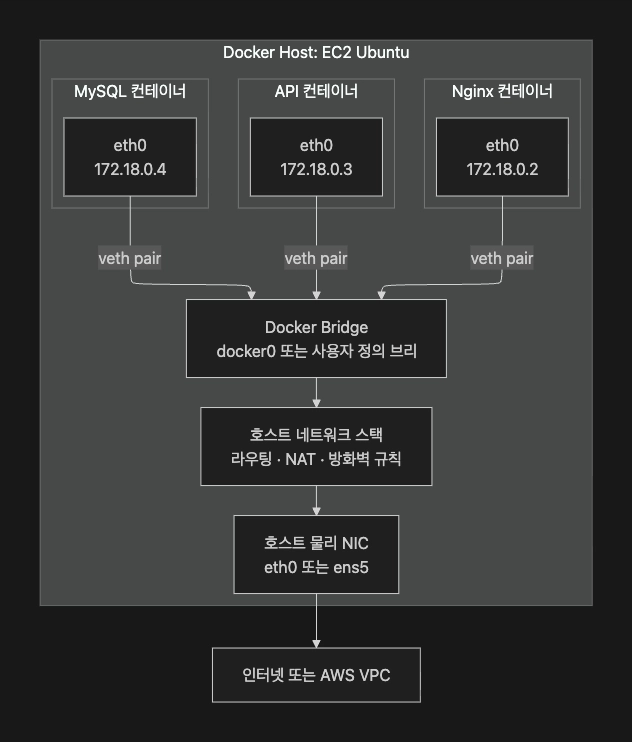

# TIL Template

## 날짜: 2026-07-01

### 스크럼
- https://app.notion.com/p/adapterz/38f394a4806180a7998bdb37827ed0ef

### Bridge Network
- 컨테이너들이 동일한 호스트 내에서 서로 통신할 수 있도록 해주는 도커의 가상 네트워크
- 브릿지 네트워크는 한 대의 도커 호스트 안에서 여러 컨테이너를 연결하는 가상 내부 네트워크
- VPC랑 비슷한 것 같네? VPC가 하나의 컴퓨터 안에서 이루어진 것 같음.
- network에서 배우는 bridge기기와 상당히 다름 통신기기는 컴퓨터를 1:1연결하는 것인데, 이것은 여러개의 container를 연결함.

#### 사용이유
- 모든 컨테이너를 그냥 호스트가 사용하는 네트워크에 연결하면 다양한 문제가 발생
    - 브로드캐스트로 인한 의도치 않은 내부 네트워크 통신이 이루어질 수 있음.

#### 개념

1. Host
- 호스트는 컨테이너를 실행하고, 관리하는 컴퓨터 (도커가 돌아가는 실제 물리 컴퓨터를 지칭하는 듯)

2. 네트워크 인터페이스
- 물리 네트워크 인터페이스: 실제 서버가 VPC, 인터넷, 사내망과 연결되는 출입구
- 가상 네트워크 인터페이스: 컨테이너가 네트워크를 사용하는 출입구
- Docker 브리지 인터페이스: 여러 컨테이너의 가상 인터페이스를 연결하는 가상 스위치
- 개인적인 생각: NAT Gateway , 컨테이너의 NIC ? , 스위치와 비슷한 것 같음.

3. 컨테이너는 자신의 네트워크 공간을 가짐.
- 컨테이너가 생성될 때 할당 받음. 꺼지면 사라짐

#### Bridge Network

* 기본 Bridge와 사용자 정의 Bridge
- 도커를 설치하면, 기본으로 Bridge가 자동 생성됨.
- 사용자 정의 bridge network는 필요한 서비스끼리 묶을 수 있고, DNS를 지원하고, 실행 중 연결/해제를 지원하기에 보통 권장됨.

#### 실무적인 구조
1. Network Segementation
2. 사이드 카 패턴
3. 워커 패턴

##### 팁
1. 기본 브릿지보다 사용자 정의 브릿지를 사용하자
- 이유는 위에를 참조

2. 컨테이너 IP값을 설정에 하드코딩하지 않는다.
- ip는 container가 삭제되고 생성되면 바뀌기에 하드코딩하지 않고 DNS를 활용해야함.

#### 추가 내용
- Docker Network Driver
- 개인적인 생각: "도커의 네트워킹 방식" 이라고 해석하면 될 듯.

- bridge, host, overlay, macvlan

##### Bridge Driver
- 가상의 스위치로 연결하는 네트워크 드라이버
- 지금까지 배운 것

##### Host Network
- 별도의 네트워크를 만들지 않고 호스트의 네트워크 공간을 직접 공유하는 방식
- host의 ip address를 사용함. 대신 포트를 컨테이너가 점유하는 방식으로 병렬구조를 형성함.

- Bridge Network보다 단순함.
- NAT, 포트 매핑이 필요없음. (? 포트 매핑이 필요없다는 것은 NAT 테이블이 없다는 것인가? 그럼 어떻게 구분함?? 예가 NAT랑 똑같은 원리인 것 같은데 그럼 필요하지 않나?)
- 해결: host IP를 공유하고 

- 컨테이너와 호스트의 네트워크 격리가 사라짐
- 여러 서비스가 한 서버에 공존하는 경우 일반적으로 사용하기 어려움.

##### Overlay Network
- 여러 Docker Host 에 흩어져 있는 컨테이너를 하나의 가상 내부망처럼 연결하는 네트워크 
- 여러 ec2 분산 된 서비스 컨테이너를 연결 할 수 있음.
- Overlay -> Docker Swarm

##### Macvlan Driver
- 컨테이너마다 별도의 MAC 부여해서 컨테이너가 마치 물리 네트워크에 직접 연결된거처럼 보이게하는 드라이버 (? 이미 MAC address를 부여하지 않나? 이건 컨테이너가 삭제되어도 고정되나? ) -> bridge driver mac address는 호스트와는 통신이 되지 않지만 다른 서브 인터페이스간 통신이 되는 방식임. 그래서 Macvlan은 외부에서 MAC address가 필요할 때 사용하는 기술임.
- 외부에서 컨테이너를 직접 보지 못함.
- 잘 사용되지 않는다함.

### 오늘의 회고
- 오늘은 강의를 듣기만하고 메모는 하지 않는 방식으로 학습을 했다. 이전에 강의를 들으면서 메모를 하려고 보니까 메모를 하다가 강의 내용을 놓쳐서 이해를 못한 경우들이 있어서 이를 해결하기 위해 먼저 강의를 들으면서 이해하고 일정이 끝나면 이후 정리를 하면서 모르는 부분이 있으면 질문하는 방식으로 하였다. 
- 이러한 방식으로 바꾸면서 강의 내용을 들을 때 한번 이해하고 정리를 하면서 이해한 내용들을 연관짓고 연상할 수 있게 되면서 잘 공부가 된 것 같다. 더욱이 이해가 되지 않는 것은 찰리에게 질문을 하면서 한번더 복습하게 되고 이해가 되지 않은 부분을 해결하게 되어 3번의 학습을 하게 되었다. 앞으로도 이러한 방식을 사용할 것 같다.
