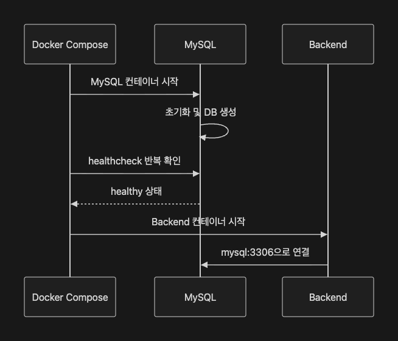

# 2026-07-02 TTL
[스크럼 notion 링크 - pappus](https://app.notion.com/p/adapterz/390394a4806180ba831cf692369e9001)

## 1. Docker Compose 
- 여러 컨테이너로 구성된 애플리케이션을 YAML형식의 파일로 정의하고, 단일 명령어로 동시에 실행 및 관리할 수 있도록 지원하는 Docker의 공식 오픈소스 도구

### 사용 이유

- Docker 명령어로만 구성했을 때는 여러개의 서비스를 실행하기가 힘듬.
- 실행 순서를 기억해서 명령어를 작성하다보니 일관적이지 않고 관리하기도 어려웠음.

### Docker Compose 의 핵심 개념

#### 1. 프로젝트 구성
    
    memo-app/
    ├── compose.yaml
    ├── backend/
    │   └── Dockerfile
    ├── frontend/
    │   └── Dockerfile
    └── nginx/
        └── default.conf

#### 2. Service 
- 실행해야하는 컨테이너의 역할
```yaml
services:
  backend:
    image: my-backend:1.0.0

  mysql:
    image: mysql:8.0

  nginx:
    image: nginx:stable-alpine
```
#### 3. Network
- compose를 사용하면 네트워크를 만들지 않아도, 기본 네트워크 자동 생성

#### 4. Volume
- 컨테이너 삭제되면 내부 데이터가 날라가기에 불륨으로 호스트 저장소 사용.

#### 5. 환경 변수
- 컨테이너마다 다른 값을 넣음. 
- 보안과 편의성을 위해서 yaml에 다 넣지 않고 .env나 Secret 관리해주는 서비스에 넣음.

#### 6. Depend_on
- 서비스간 생성, 시작 순서, 의존성을 선언함.
- 컨테이너의 생성 시작 순서를 조정할 수는 있지만, 상대적 시간이 아닌 절대적 시간을 지정하기에 실제 요청 준비 순서를 보장하지는 않음.
- 여기서 health 체크를 해서 의존성이 강한 backend 코드와 mysql관계에서 사용함. (mysql이 먼저 생성된 후 backend 생성)


#### 개발 서버를 만들 때 많이 사용함
- 운영 서버는 보통 컨테이너들이 분리되어 구성됨. 
- 개발 서버는 하나의 서버를 운영하는 경우가 많아서 하나의 ec2에 여러가지 컨테이너를 둬야함.

### 주의 사항
1. latest 태그를 피해야함
   - 실제로는 어떤 버전을 배포하는지 모르게 됨.
  
2. depend_on을 신뢰하지 않아야함
   - 의존성이 꼭 필요한 경우에는 health check를 하는게 좋음. 
 
3. 로그 회전 설정 
   - 로그는 계속 쌓이기 때문에 오래된 로그는 지워서 저장소 공간을 과하게 차지하지 않도록 계속 순환시켜야함.

### 오늘의 회고
- 오늘 강의는 무난하게 들었던 것 같다. 하지만 실습을 진행하면서 다양한 트러블 슈팅이 발생해서 고됐던것 같다.
