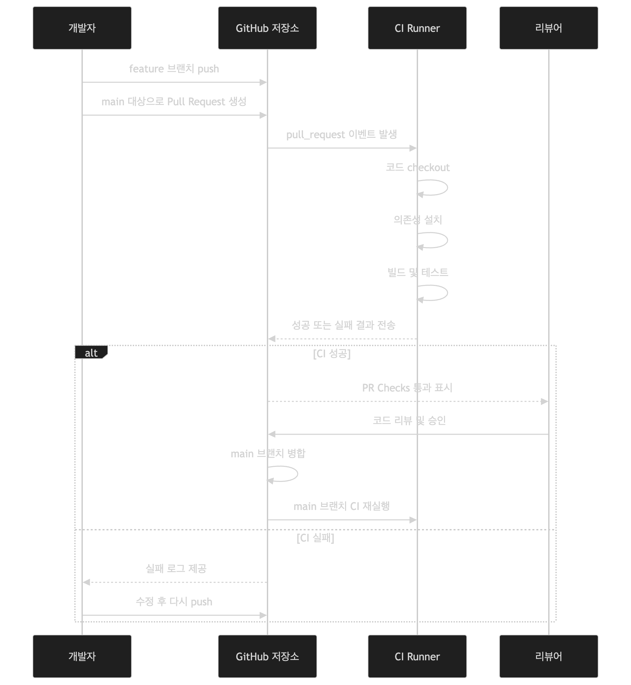
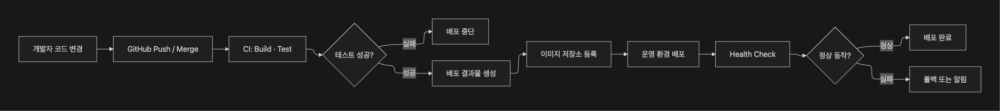
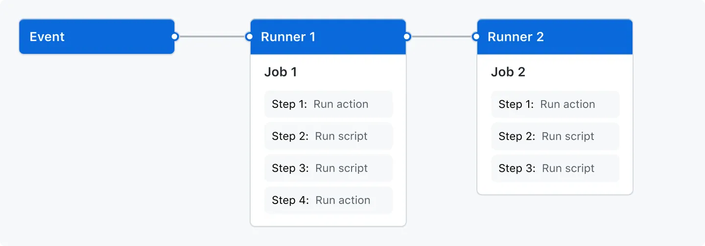

# 2026-07-06 TTL

## 새로 배운 내용
### Continous Integration
- 개발자가 적송헌 코드를 통합 및 테스트하여 코드의 품질을 지속적으로 유지하는 개발 프로세스
- 이전에는 개발자들이 개발을 계속하고 마지막에 한 번 합쳐서 많은 문제가 발생하고 그것을 해결하면서 많은 시간을 소모하게됨. 이것을 해결하기 위해 개발 팀원들이 작성한 코드를 최대한 자주 통합하는 소프트웨어 개발 방법론 중 하나임.

#### CI를 사용한다면
- 개발자는 PR를 요청하면 컴파일 확인을 하고 코드 리뷰를 통해 코드의 품질을 지켰는지 문제는 없는지 확인할 수 있음.
- 운영 서버에 넣어서 문제가 나타나기 전에 github같은 저장소에서 먼저 실패함.

| 문제 | CI가 해결하는 방식 |
| --- | --- |
| 개발자가 로컬에서만 테스트함 | 공통된 Runner 환경에서 자동 검증 |
| 병합 후 빌드 실패 발견 | PR 또는 main 병합 직후 자동 빌드 |
| 테스트를 빼먹음 | 테스트 실행을 병합 조건으로 설정 |
| 코드 리뷰만으로 오류를 찾으려 함 | 자동 테스트와 정적 분석을 함께 실행 |
| 누가 언제 깨뜨렸는지 모름 | 커밋·PR 단위의 실행 로그와 결과 제공 |
| 배포 직전에 여러 문제를 한꺼번에 발견 | 작은 변경 단위로 빠르게 실패 발견 |

#### CI 원칙
##### 1. 하나의 코드 기준 베이스
- 브랜치를 전략으로 나눔

```
main -> 항상 배포가 가능한 상태를 목표로 하는 "기준이 되는 브랜치"

dev -> 개발자들이 작업을 수행하는 브랜치

feature -> 특정 기능 개발하는 브랜치

main -> dev 로 브랜치를 하나 만듭니다.

dev 에서 
a -> feature/login
b -> feature/payment
c -> feature/coupon

dev 에 합치는 과정으로 수행한다.
```
##### 2. 변경 사항을 자주 통합.
- 개발자가 너무 오랫동안 메인 코드랑 분리된 상태로 작업하지 않아야함. 큰 기능을 만들고 한참 뒤에 합치면 문제점이 너무 많아졌고 변경점도 많아서 문제들을 찾고 해결하기가 힘들어짐.

###### 3. 재현 가능한 빌드
- 로컬환경과 CI서버 환경은 다르기에 다양한 문제가 생김
- 그래서 아래의 코드들이 사용하는 것이라면 있어야함.
  
| 항목 | 역할 |
| --- | --- |
| `pom.xml`, `build.gradle` | Java 의존성과 빌드 설정 |
| `package.json`, `package-lock.json` | Node.js 의존성과 버전 고정 |
| `Dockerfile` | 컨테이너 실행 환경 정의 |
| `docker-compose.yml` | 여러 컨테이너 구성 정의 |
| `.github/workflows/*.yml` | GitHub Actions 자동화 정의 |
| 테스트 코드 | 기대 동작 정의 |
| 환경 예시 파일 | `.env.example` 등 설정 구조 공유 |

#### 4. 자동으로 테스트를 톨려야함.
- CI를 통과한다고 무조건 배포해서 돌리면 성공하는 것은 아니다. 결국 테스트 코드를 통과했을뿐 다른 문제가 있을 수도 있음.
- 형식은 보통 given, when, then임

- 테스트 코드 종류
  
| 종류 | 확인 대상 | 특징 | CI 적용 우선순위 |
| --- | --- | --- | --- |
| 단위 테스트 (Unit Test) | 함수, 클래스, 서비스 로직 | 빠르고 원인 추적이 쉬움 | 매우 높음 |
| 통합 테스트 (Integration Test) | DB, Redis, API, 여러 모듈의 연결 | 실제 환경 문제를 더 잘 발견 | 높음 |
| E2E 테스트 (End-to-End Test) | 사용자의 전체 흐름 | 실제 사용자 경험과 가까움 | 선택적·핵심 시나리오 |
| 정적 분석 (Static Analysis) | 코드 규칙, 잠재 오류 | 실행 전 코드 품질 검사 | 높음 | 

##### test code 작성시 유의사항
1. 동작을 검증한다
2. 하나의 기능만 검증한다.
3. 테스트는 서로 독립적이여야 한다.

##### 특징
1. 장점 
   - 요구사항을 먼저 코드로 작성 (설계도 느낌)
   - 작은 단위 개발 (블록을 차근차근 쌓아서 기능하나를 실수 없이 완성하는 느낌)

2. 단점
    - 오류가 발생할 지점을 모두 예측이 거의 불가능함..
    - 오용하면 테스트를 통과만 하는 코드를 작성하여 안전한 코드를 작성했다고 착각함.

- Test code coverage: 테스트 코드를 전부 적용하는 것은 매우 힘들고 상황에 따라서 비효율적일 수 있음. 테스트 코드 커버리지를 설정하고 이를 따르는게 좋음. 

#### PR -> CI 흐름


#### CI는 PR에서도 하고 Main에서도 함
- PR은 Main으로 병합하기 전 코드가 유효한지 확인
- Main에서는 병합되고 문제가 없는지 확인

#### CI 품질 게이트를 설정해야함.
- 초기 프로젝트에는 이런 기준을 잡는게 좋다.

| 단계 | 필수 여부 | 이유 |
| --- | --- | --- |
| 컴파일·빌드 성공 | 필수 | 실행 불가능한 코드는 병합하면 안 됨 |
| 단위 테스트 통과 | 필수 | 핵심 로직 회귀 방지 |
| 통합 테스트 통과 | 가능하면 필수 | DB·Redis·외부 연동 오류 확인 |
| PR 리뷰 승인 | 팀 상황에 따라 | 설계·가독성·의도 검토 |
| 정적 분석 | 점진적 도입 | 코드 규칙과 잠재 문제 탐지 |
| 보안 검사 | 점진적 도입 | 알려진 취약점 탐지 |
| E2E 테스트 | 핵심 기능만 | 느린 테스트의 비용 관리 |

### Continuous Delivery/Deployment
- 배포 과정을 자동화 + 배포 검증 + 실패시 복구
- 배포하는 과정을 코드로 만들어서 자동화함.

#### CD 의 흐름



| 단계 | 하는 일 | 예시 |
| --- | --- | --- |
| CI | 코드 품질 검증 | 빌드, 테스트, 정적 분석 |
| Artifact 생성 | 배포 가능한 결과물 생성 | `.jar`, Docker 이미지, `dist/` |
| Registry 저장 | 결과물을 저장하고 배포 대상에 전달 | Docker Hub, Amazon ECR |
| Deploy | 서버 또는 플랫폼에 새 버전 반영 | EC2, ECS, Kubernetes |
| Health Check | 새 버전이 실제로 정상 동작하는지 확인 | `/health` API 호출 |
| Monitoring | 배포 이후 장애 여부 확인 | 로그, 에러율, CPU, 응답 시간 |
| Rollback | 문제가 발생하면 이전 안정 버전으로 복구 | 이전 이미지 재배포, 트래픽 전환 |

#### Artifact
- CI를 통과하고 실제로 배포할 수 있는 것 (.jar파일)

- 아티팩트를 보관하는 이유
1. 배포할 운영 서버들이 일정하지 않아서
2. Github action은 step 별로 아티팩트를 공유하지 않음.

#### Delivery vs Deployment
- 배포할 때 사람이 중간에 개입하냐 마냐의 차이

| 구분 | Continuous Delivery | Continuous Deployment |
| --- | --- | --- |
| 한국어 표현 | 지속적 전달 | 지속적 배포 |
| 테스트·빌드 | 자동 | 자동 |
| 이미지 생성·저장 | 자동 | 자동 |
| 스테이징 배포 | 자동 | 자동 |
| 운영 배포 | 승인 후 실행 | 자동 실행 |
| 핵심 가치 | 안정성, 통제 | 속도, 자동화 |
| 적합한 환경 | 금융, 공공, 대기업, 승인 절차가 필요한 조직 | 빠른 배포와 피드백이 중요한 서비스 |

### Github Actions
- Github에서 이벤트가 발생했을 때 빌드, 테스트, 배포같은 작업을 자동으로 실행하는 CI/CD 플랫폼

- 과정
```
1. GitHub에 코드 Push
2. 로컬 또는 서버에서 최신 코드 Pull
3. 의존성 설치
4. 테스트 실행
5. 빌드
6. Docker 이미지 생성
7. Docker Hub 또는 ECR에 Push
8. EC2 또는 ECS에 배포
9. 배포 결과 확인
```

- Github docs에서 나오는 이미지


#### 1. Event
   - 자동화를 시작하는 타이밍의 시작

    | Event | 사용 사례 |
    | --- | --- |
    | `push` | main 브랜치 병합 후 배포 |
    | `pull_request` | PR 생성 시 테스트, 린트, 빌드 검증 |
    | `workflow_dispatch` | GitHub 화면에서 수동 실행 |
    | `schedule` | 매일 새벽 보안 검사, 정기 배치 작업 |
    | `release` | 릴리스 생성 시 패키지 배포 |
    | `issues` | 이슈 생성 시 Slack 또는 Discord 알림 |

#### 2. Workflows
   - Github actions가 수행할 흐름

    ```
    / -> 
    폴더를 .github 
    그 아래 폴더로 workflows

    my-project/
    -- src
    -- package.json
    -- .github/
        -- workflows/
            ci.yml
            cd.yml
    ```

#### 3. Runner
- [self-hosted runner 참고자료](https://docs.github.com/en/actions/concepts/runners/self-hosted-runners)
- Job이 실제로 실행되는 서버환경
  
| Runner 유형 | 설명 | 적합한 상황 |
| --- | --- | --- |
| GitHub-hosted Runner | GitHub가 관리하는 임시 실행 환경 | 일반적인 CI, 테스트, 빌드 |
| Self-hosted Runner | 회사 또는 개인이 직접 설치·운영하는 Runner | 내부망 접근, 사내 서버 배포, 특수 장비 사용 |

#### 4. Job
- Workflow안에서 실행되는 독립적 작업 
- 개인적인 생각: 또는 같은 Runner에서 동작하는 작업
- Job을 너무 잘게 쪼개지 마라
- Job은 각각 병렬로 다른 Runner를 사용함, 결과 파일을 공유하려면 별도로 설정해야해서 번거로움.

#### 5. Step
- Job 내부에서 순차적으로 실행되는 한 단계

#### 6. Actions
- 반복 기능을 재사용하는 자동화 코드
- Action에서 자주 사용되는 것들
  
| Action | 역할 |
| --- | --- |
| `actions/checkout` | GitHub 저장소 코드를 Runner로 내려받음 |
| `actions/setup-node` | Node.js 설치 및 설정 |
| `actions/setup-java` | Java 설치 및 설정 |
| `actions/cache` | 의존성 캐시 저장 및 복구 |
| `docker/login-action` | Docker Hub 또는 Container Registry 로그인 |
| `docker/build-push-action` | Docker 이미지 빌드 및 Push |
| `actions/upload-artifact` | 빌드 결과물 업로드 |
| `actions/download-artifact` | 다른 Job에서 빌드 결과물 다운로드 |


### 한줄 정리
 - CI: 코드를 자동을 통합 및 테스트하는 것, 코드 품질 유지를 위해서
 - Test Code: 코드를 테스트하기 위한 코드, 설계한데로 코드가 동작하나 확인하기 위해서 
 - Test Coverage: 테스트코드가 실제 코드의 검증 범위를 나타내는 지표, 테스트 코드가 검사하는 범위를 알기 위해서
 - TDD: 구현 코드작성 전에 테스트 코드를 통과시켜야 하는 개발 방법론, 요구사항을 만족시키는 코드를 틀에 맞게 작성하기 위해서
 - Given-When-Then: 테스트 코드를 작성하기 위한 방법, 쉽게 읽고 작성하기 위해서
 - CD: 운영 환경까지 자동으로 배포하는 프로세스, 편하게 배포하기 위해서
 - Github Actions: github에서 제공하는 CI/CD 플랫폼
 - Github Actions Workflows: 하나 이상의 작업을 구성할 수 있는 작업, 흐름을 컨트롤하기 위해서 
 - Github Actions Runner: 워크플로를 실행하는 서버, 위크플로를 구성하기 위한 블록
 - Github Actions Jobs: 동일한 러너에서 실행되는 워크플로의 단계, 흠.... 사용이유가 애매한데 같은 서버에서 실행되는 runner들을 파악하기 위해서?
 - Github Actions Artifact: 실제로 배포할 수 있는 결과물, 검증된 배포하기 위해서?


### 오늘의 회고
- 오늘은 CI/CD를 학습했는데 들어보기만 했지 이렇게 세세하게 본적은 없어서 신기했다. 하지만 날씨가 우중충하니 어둑어둑해서 많이 피곤했다. 24시에 문닫고 나가서 아침 8시 50분에 오니까 잠을 7시간 이하로 자는데 쉽지 않은 것 같다. 7시간 자면 충분할 줄 알았는데 그 이상 자야하는 것 같다. 주말에 더욱 푹 자던가 아니면 수요일날은 일찍 집으로 들어가는 방식으로 컨디션 관리를 해야겠다.
- 실습은 간단하였고 수업 강의의 내용은 그렇게 어렵지 않아서 저번주에 있었던 특강 내용을 정리하였다. 많은 키워드들과 설명 그리고 영감을 얻어서 이를 기록하고 정리하였는데 좋았다. 하지만 이미지는 공유가 안되서 TIL에 넣지는 못했고 내용도 내가 가변해서 넣어야한다고 해서 문의를 넣었더니 최종편을 보내면 보고 검수해주신다고 해서 보냈다. 내일 결과 나오면 push할 계획이다.

### 참고 자료 및 링크
- [Github docs]([URL](https://docs.github.com/en/actions/get-started/understand-github-actions))
