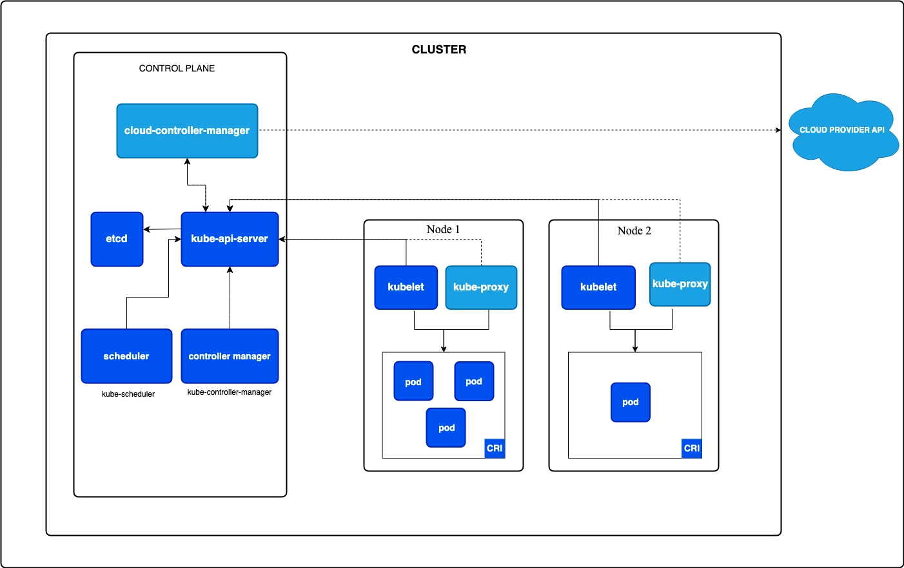

# 2026-07-02 TTL

## 새로 배운 내용
### Kubernetes (k8s)

- 여러 서버에서 실행되는 많은 컨테이너를 자동으로 배치하고, 감시하고, 복구 등을 하기위한 컨테이너 오케스트레이션 플랫폼.
- 하는 일
  - 컨테이너를 어느 서버에 배치할지 결정
  - 필요한 수만큼 컨테이너 실행
  - 장애가 발생한 컨테이너 복구
  - 서버와 컨테이너 상태 감시
  - 트래픽 증가
  - 애플리케이션 실행 상태유지
  
1. 물리서버
    - 하나의 물리서버에 앱 설치
    - 문제점
      - 하나의 애플리캐이션이 느려지면 다른 것도 느려짐
      - 애플리케이션마다 필요한 라이브러리가 다름. 충돌가능성
      - 안정성이 떨어짐
      - 물리서버는 확장하기 어려움.
2. 가상 머신
    - 하나의 물리서버를 논리적으로 나누어서 사용함.
    - 애플리케이션 간 격리를 통한 자원 분리
    - 확장성이 좋아짐.
    - 운영체제가 있어서 발생하는 문제점
      - VM마다 운영체제를 사용해서 확장할 때 아직 무거움
      - VM 이미지가 상당히 큼
      - 보안패치를 주기적으로 해줘야해서 번거로움
3. 컨테이너
   - 컨테이너는 각 VM을 분리한 것처럼 운영체제를 따로 만들지 않음
   - 호스트의 운영체제에 있는 커널을 공유해서 사용함.
   - VM보다는 가벼워시 실행시간이 빠름
   - CICD가 편해짐
   - 컨테이너의 수가 많아졌을때 관리하기 힘들어짐.

#### 쿠버네티스가 해결하는 것
1. 컨테이너를 자동으로 실행,배치
2. 현재 클러스터 내에 서버의 자원 사용량을 실시간 모니터링
3. 컨테이너가 사용하고 있는 자원량도 실시간 모니터링
4. 서버 자원을 알고있으니 필요한 컨테이너를 자원에 맞춰서 배치
5. 특정 서버가 에러나면 필요한 컨테이너를 자동 재배치
6. 필요한 처리량에 따라서 필요한 컨테이너를 늘렸다 줄였다함.
7. 롤링 업데이트 지원
8. 중앙에서 관리할 수 있게함.

#### 컨테이너 오케스트레이션
- 여러 서버에서 실행되는 많은 컨테이너를 배치하고, 연결하고, 감시하고, 복구하는 작업을 자동화하는 것.
- Docker: 컨테이너를 만들고 실행하는 도구
- Kubernetes: 여러 서버에서 많은 컨테이너를 관리하는 도구
  
- 쿠버네티스는 이해할 때 필요한 핵심 개념
1. 선언적 관리
2. 원하는 상태
3. 지속적인 상태 조정

##### 1. 선언적 관리
- 사용자가 작업 방법을 

- 명령형 관리: 운영자가 서버에 접속해서 명령어로 관리함
- 선언형 관리: 운영자가 최종적으로 원하는 상태를 정의함.

##### 2. 원하는 상태, Desired State
- 사용자가 k8s한테 원하는 상태를 전달.

```text
애플리케이션은 세 개 실행
각 앱 -> 500MB 사용
지정한 컨테이너 이미지 사용
```

- 현재 상태
  - 실제 쿠버네티스 내에서 실행되고 있는 상태
  - 쿠버네티스에서는 **원하는 상태와 현재 상테를 지속적으로 비교***
  
##### 3. 지속적으로 상태를 조정
- 쿠버네티스는 현재 상태를 관찰, 원하는 상태와 다르면 필요한 작업을 수행.
- 반복적인 조정이 쿠버네티스의 자동화 핵심
  
#### 쿠버네티스 요소
##### 클러스터
- **쿠버네티스가 관리하는 여러 서버, 컨테이너, 리소스의 집합**
```
Kubernetes Cluster
├── Control Plane
├── Worker Node 1
├── Worker Node 2
└── Worker Node 3
```
- 클러스터를 구성하는 각 서버는 모두 **Node**라고 부름.
- 노드는 물리서버, 가상 머신, 온프레미스 서버 등이 될 수 있음.
- 일반적으로 클러스터를 구성할 때는 하나의 노드 구성을 유지하는 경향이 있음. (아니면 운영 복잡도가 높아짐)

##### Control Plane
- 클러스터 전체의 상태를 관리하고, 파드 배치를 판단하는 중앙 제어 영역
- 역할
  - 사용자의 요청 수신
  - 클러스터의 상태 저장
  - 현재 상태랑 원하느 상태 비교
  - 실행 할 노드결정
  - 장애 감지
- Master Node 라고도 불림 (민감한 단어들)

```
Control Plane
├── kube-apiserver
├── etcd
├── kube-scheduler
└── kube-controller-manager

```

##### 1. kube-api-server
- 쿠버네티스 클러스터로 들어오는 모든 관리 요청의 중앙 출입구
- 사용자가 *kubectl* 명령어를 내리면, 워커 노드에 직접 전달되지 않음.
- 명령어는 먼저 API server에 전달
- kubectl get nodes
  - 사용자 -> kubectl -> control plane -> api-serve-> 클러스터 내부 구성요소
- API server durgkf
  - 사용자 요청 수신
  - 사용자 인증
  - 권한 확인
  - 요청 내용을 검증
  - 내부 구성 요소간 통신 중계
  - 클러스터 상태 변경
  - 상태 조회
  
##### 2. etcd
- 클러스터의 설정, 상태를 저장하는 **분산** key-value 저장소
- 예시
  - node가 뭐가 있음.
  - 에플리케이션 뭐가 실행되어야 함.
  - 현재 상태
- etcd 데이터는 사실 쿠버네티스가 하려고 하는 모든 정보가 저장되어서 중요함.
- 운영 환경에서는 etcd 백업, 다중화, 복구 작업 준비, 접근 제한을 함.
- etcd는 애플리케이션 데이터베이스가 아니고 쿠버네티스 클러스터에서 필요한 자체적인 상태를 저장하는 key-value 저장소임. 

##### 3. kube-scheduler
- 새로운 실행 단위(파드)를 어느 워커 노드에 배치할지 결정하는 구성요소
- 스케줄러는 아직 실행할 노드가 정해지지 않은 실행 단위를 적절한 워커를 선택하는 구성요소
- 고려 사항
  - Node CPU, Mem 자원
  - 애플리케이션 요청한 자원
  - Node 상태
  - 설정한 배치 조건
  - 스토리지 조건
- 컨테이너를 실행하지는 않고, 실행할 노드를 결정하기까지만 함.

##### 4. kube-controller-manager
- 현재 상태를 원하는 상태로 맞추는 여러 제어 기능을 실행하는 구성 요소
- 클러스터의 상태를 계속 확인
- 흐름 순서
  1. 현재상태가 원하는 상태와 다른 것을 파악
  2. 조정을 명령
  3. kube-controller-manager이 감지
  4. 부족한 실행단위를 생성 요청

##### Worker Node
- 실제 애플리케이션이 실행되는 서버
- 정확한 표현은 애플리케이션, 컨테이너가 아니라 파드임. 하지만 아직 파드를 배우지 않았기에 이렇게 설명
- 컨트롤 플레인이 두뇌면 워커노드는 실제 작업을 수행하는 손발이라고 생각하면 됨.
```
Worker Node
├── kubelet
├── Container Runtime
├── kube-proxy
└── 애플리케이션 실행 단위
```
- 역할  
  - 컨테이너 이미지 다운로드
  - 컨테이너 실행
  - 컨테이너 상태 확인
  - 네트워크 통신 처리
  - 장애가 발생했을 때 컨테이너 재시작
  
##### 1. kubelet
- 각 워커노드에서 애플리케이션 실행 상태 관리, 컨트롤 플레인에 보고 하는 에이전트
- kubelet, Worker node
- kubelet 역할
  - API Server 통신
  - 실행해야 하는 작업 확인
  - 컨테이너 런타임에 특정 작업을 요청
  - 컨테이너 상태확인 
  - 애플리케이션 상태 점검
- kubelet, Worker Node에서 실제 실행 상태를 책임지는 에이전트

##### 2. Container Runtime interface (CRI)
- 컨테이너 이미지 가져오고, 실제 컨테이너 프로세스를 실행하는 소프트웨어
- 쿠버네티스는 **관리 소프트웨어**이지 컨테이너 프로세스를 직접 실행시키지 않음.
- 대표적인 Container Runtime
  - Docker
    - k8s에서 요구하는 Container Runtime 필수 요소
    - docker에서 지원하지 않음.
  - containerd
  - CRI-O
- 쿠버네티스에서 도커 이미지를 사용한다고 해서 도커를 설치할 필요는 없음.
- Docker Engine
  - 컨테이너를 관리하기 쉽게 만든 컨테이너 관리 도구
  - container를 실행 할 수 있는 런타임만 있으면 쿠버네티스는 동작함.
  
##### 3. kube-proxy
- Worker Node에서 네트워크 트래픽을 전달하기 위한 규칙을 관리하는 구성 요소
- 클러스터 내에 노드들은 분산되어있어서 컨테이너 간의 통신을 하려면 필요함.
- kube-proxy는 워커 노드의 네트워크 규칙을 관리하고 트래픽이 적절한 목적지로 전달할 수 있도록 직원
  
##### 4. Pod
- 쿠버네티스가 컨테이너를 실행하고 관리하는 가장 작은 배포 단위
- 쿠버네티스는 일반적으로 컨테이너를 직접 실행 단위로 다루지 않고 pod로 관리함.
- 하나의 pod에는 하나 이상의 컨테이너가 들어갈 수 있음.
``` text
Cluster -> Worker Node -> Pod -> Container
```

#### 쿠버네티스 사용이유
- 애플리케이션의 배포,확장,감시 등을 자동화해서 운영 복잡성을 줄이기 위해서
1. 자동 복구(오토 힐링)
    - 컨테이너가 종료되거나 애플리케이션에 문제 발생시, 자동으로 재시작
    - 운영시간 줄어듦.
    - 장애 대응 시간 감축
    - 주의점: 애플리케이션 오류를 수정하는 것이 아님.

2. 배치가 자동으로
- 쿠버네티스 etcd node의 상태 기록
- 애플리케이션 요구사항을 보고 자동으로 필요한 노드에 배치함.
- 장점
  - 서버마다 들어가서 설정할 필요 없음.
  - 자원 고려해서 배치할 수 있음 (생각보다 PinOps)
  - 워크로드 분산이 알아서 됨.

3. 확장성
    - 애플리케이션이 더 필요하면 원하는 상태를 늘리면 됨.
    - 트래픽이 줄면 알아서 줄어들 수 있음 (HPA)

4. 운영 환경의 일관성
   - 실행 환경, 원하는 상태를 YAML 파일 정의
   - 이 파일을 관리하면 운영환경이 어디에서나 똑같이 돌릴 수 있음.
     - CSP에 종속되지 않음. 
       - CSP: Cloude Service Provider
       - AWS,GCP,NCP
     - 한 클라우드를 사용하다가 갑자기 다른 클라우드로 사용하려면? 변경이 상당히 어려움.

5. 선언적 관리
   - 원하는 상태 정의로 반복적인 운영이 감소함.

#### 쿠버네티스의 절대적인 단점

1. 학습 난이도가 지나치게 높음.
   - 30% 앱 개발, 70% 쿠버네티스 관리하면 의미없음.
   - Linux, Container, OS, Network, Storage, 보안, Cloud, Distributed System, 중앙 집중식 로깅을 모두 알아야함.

2. 운영 구조가 너무 복잡함
   - Control Plane
   - Worker node
   - etcd
   - Conatainer Runtime
   - CNI
   - Core DNS, Local DNS 등등
   - 이것들을 구성해야함.

3. 장애 원인을 찾기 힘듦.
    - 쿠버네티스에서 사용자의 요청이 여러 레이어를 거쳐서 동작함. 
    - 어떤 파드가 어디 노드에 배치될지 예상할 수가 없음.
    - 로깅, 모니터링이 중앙 집중형 모니터링이 필요함. 

4. 비용이 증가함.
   - 최소 구성이 EC2 t3.medium 2대 + t3.small 1대 정도 (BE만 서빙 한다고 했을 때)
   - DB t3.medium 2대, FE t3.medium 2대
   - etcd를 고가용성 구성을 하려면 master node 2개 이상 구성

5. 작은 서비스에서는 의미가 없음.
   - QPS 기준 3000까지는 EC2로만 돌려도 됨.

#### 실무에서 사용하는 법

1. 관리형 서비스를 많이 사용함.
- 서비스 안정성이 비용보다 가치가 높은 기업에서 상요함.
- 우리는 학습에서 kubeadm 이라는 배포 패키지를 사용함.
- 쿠버네티스가 요즘에 **대규모 트래픽**을 가진 곳에서 활용함.
  - 스타트업은 대부분 클라우드를 사용함. 95%
  - 대기업은 클라우드 도입 비율이 그렇게 높지 않음. 70%
    - 30%는 온프레미스 환경
  - 고가용성, 확장성이 필요함.
  - 관리형 서비스가 아닌 쿠버네티스를 다룰 줄 알아야 함.
 
2. CICD 환경이랑 같이 묶어서 사용함.
- 컨테이너 런타임이 실행될 때, 이미지를 항상 Registry에서 가져옴.

3. 서비스가 많을 때 도입
- MSA
  - 커뮤니티 서비스를 운용하다가 게시판 기능을 강화함.
  - RDBMS로 MySQL를 사용하다가 게시판 기능에서 필요한 데이터베이스가 점점 mysql은 아니게 됨.
  - Doc DB가 유용하게 되어 게시판 서비스를 분리함. 
  - 이 과정이 반복되면 MSA
- 이럴때 쿠버네티스가 유용해짐

4. 중앙 집중형 모니터링, 로깅 시스템 필수
- 분산되어 있는 시스템이기에, 문제 발생원인을 파악하기 힘들음.

#### 우리가 오해 할 수 있는 것들
1. 쿠버네티스를 사용하면 장애 내결함성이 생간다.
- 네트워크 오류, 애플리케이션 에러, 자원 부족 등으로 장애가 발생하면 쿠버네티스로는 해결하지 못함.

2. 컨테이너가 많다으니까 쿠버네티스를 써야한다.
- 컨테이너 수만 가지고 도입하지 않음.
  - 컨테이너에서도 운영이 힘든가
  - 장애감지가 필요한가
  - 트래픽에 따라서 컨테이너 늘리고 운영 자동화가 필요한가
  - 개발팀 규모, 배포 빈도, 트래픽 변화, 비용(최소 100만원 정도 나온다고 생각함.) 등등 

#### CNI와 Flannel
- 쿠버네티스는 파드를 생성하고 어디 노드에서 실행할지 결정
- Pod에 IP를 부여하고, 서로 통신할 수 있는 네트워크를 직접 구현하지 않음.
- CNI 플러그인
  - Flannel이라는 플러그인
- Pod도 ip주소가 필요함.
  - Pod도 다른 Pod랑 통신해야하는데, 통신을 하려면 IP주소가 필수임.
  - 하지만 Pod는 다른 node에 있는 Pod의 ip 주소를 모름

##### Container Network Interface (CNI)
- 컨테이너 네트워크 설정하고, 제거하는 방법을 정의한 표준 규격 인터페이스
- 컨테이너끼리 통신하기 위한 규약
  - 컨테이너, 파드에 네트워크 인터페이스 연결
  - IP 주소, 라우팅 설정
  - 컨테이너 삭제될 때 네트워크 자원정리
- 인터페이스의 구현체가 CNI 플러그인
  - Flannel
- 사용이유
  - CSP에 종속되지 않기 위해서(AWS, GCP에 종속 X)
  - 쿠버네티스가 직접 모든 네트워크 환경을 지원해야하는데 이것을 대신함.
  - 라이브러리 같이 전문적인 네트워크 기능을 맡긴 것
- CNI 플러그인  
  - Flannel CNI
  - Calico CNI
  - Cilium CNI

##### Flannel
- 여러 노드에 있는 pod가 통신할 수 있도록 Pod 네트워크를 구성하는 네트워크 플러그인임.
- 우리가 사용할 대역폭은 10.244.0.0/16
- 사용 이유
  - 같은 노드에서의 통신은 노드 내부의 가상 네트워크를 통해서 서로 통신할 수 있음.

##### VXLAN
- Pod 패킷 Node 간 전달할 때, UDP 패킷 안에 한번 더 감싸는 터널링 기술


### 한 줄 정리
 - Kubernetes: 여러 노드를 자동으로 관리하는 기술, 서버가 많아져서 관리하기 힘들어져서 이를 해결하기 위해
 - 선언적 관리: 내가 원하는 상태를 지정하여 관리하는 형태, 명령어로 하나하나 관리하기 힘들어서
 - Master Node: worker node들을 중앙집중으로 관리하는 노드, 분산되어있는 node를 한번에 관리하기 위해서.
 - etcd: k8s를 위해 필요한 상태 정보들을 저장하는 곳, 관리를 위한 상태정보들을 저장하기 위해서.
 - kube-scheduler: 프로세스가 추가적으로 필요할 때 자동으로 추가할 노드를 지정해주는 것, 효율적인 관리를 위해서
 - kube-controller-manager: 사용자가 원하는 형태를 만들기 위한 것. k8s 제어를 위해서
 - Worker Node: 실제로 프로세스들이 실행되는 곳, 프로세스 실행을 위해서
 - kubelet: pod의 상태들을 저장하는 곳, master node에게 보고하기 위해서
 - kube-proxy: worker node의 네트워크 담당, 네트워크를 구현하기 위해서
 - CNI: Pod간의 네트워크 통신을 위한 규약
 - Flannel: CNI의 구현체, 네트워크 통신을 위해서
 - VXLAN: Pod 패킷을 다른 node간 전달하기 위한 UDP로 캡슐화하는 터널링 기술


## 오늘의 회고
- 오늘은 기본적인 내용들을 반복하여 학습하여 앞으로 배울 쿠버네티스에 힘들지 않도록 단련했다. 실습을 하면서 설정을 작성하고 가이드를 따라갔는데, 흐름만 이해할 수 있었고 어떠한 코드가 어떠한 역할을 하는지 정확하게는 잘 모르겠다. 코드가 어떠한 역할을 하는지 알아야하는 것 같기도한데 또 그렇게까지는 필요없는 것 같아서 햇갈린다.

