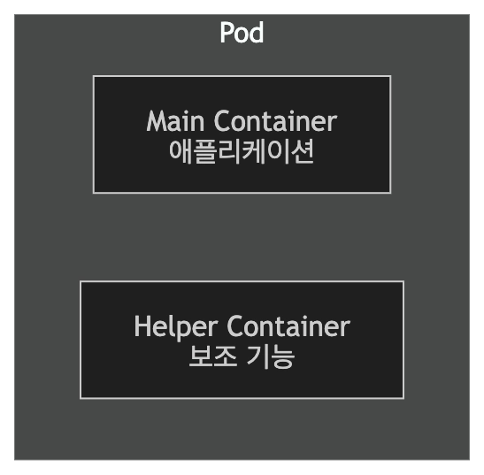
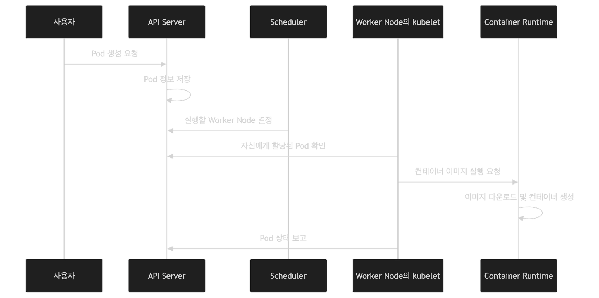

# 2026-07-14 TTL

## 스크럼
[스크럼 URL](https://app.notion.com/p/adapterz/39c394a48061801ea36af94ecbf5f385)

## kubectl
- 쿠버네티스 Server Api 명령을 전달함
```
kubectl [동작] [리소스] [리소스 이름] [옵션]
```
### 축약어
| 전체 이름 | 축약형 | 의미 |
| --- | --- | --- |
| `pods` | `po` | Pod |
| `nodes` | `no` | Node |
| `services` | `svc` | Service |
| `namespaces` | `ns` | Namespace |
| `deployments` | `deploy` | Deployment |

- 나중에는 커스터마이징 하는 축약어를 쓰게 됨.

#### 리소스 생성
- apply , create
- apply 위주로 사용(create는 생성하는데 기존 리소스가 똑같인것이 있으면, 생성하지 않고 충돌이 일어남)

#### 리소스 삭제
```
kubectl delete ~
-f 파일
-l 라벨
pod 이름으로
```

#### 리소스 내부로 들어가기
```
kubectl exec -it express-pod -- /bin/sh
```

### Pod
- 하나 이상의 컨테이너를 구룹화하여 실행 환경, 네트워크 자원, 스토리지를 공유하는 가장 작은 배포 단위

#### Pod가 필요한 이유
- 워커 노드: 우리의 파드가 실행되는 공간
- 쿠버네티스는 컨테이너를 가축처럼 취급
- 컨테이너 개수가 2개 이상이부터 문제 발생
  - 백엔드 동작을 위해서 필요한 컨테이너가 backend container + json-parser container 두 개일 경우에 하나만 있으면 백엔드의 역할을 수행하지 못함. 이를 묶을 것이 필요함. 이게 pod 
- 실무적으로는 보통 파드 하나에 컨테이너 하나를 두는 경우가 많음.
- ? 그러면 위에 말한 필요한 이유가 의미 없는 것 아닌가? 이 의문에 대해서는 아래에서..

#### Pod를 쓰면 얻는 이점
- 하나만 쓰더라도 써서 얻는 이점이 있음.
  - 파드 내부 컨테이너들끼리 네트워크, IP주소, 포트 등을 공유함.
  - 로컬 호스트 통신이 가장 빠른 통신임
  - 근데 이거 docker network로 할 수 있는 것 아닌가?

#### Pod 네트워크
1. Pod 별로 ip를 할당함.
2. 같은 파드의 컨테이너는 ip를 공유함.
   - 로컬호스트 통신이 가능한 것이 장점이긴한데, 동일한 포트를 사용할 수는 없다는 단점이 있음.

#### Pod 볼륨
- 파드에는 내부 컨테이너들이 접근할 수 있는 볼륨을 연결

#### Pod 유형
1. Pod 1
   - 단일 컨테이너 구조
   - 실무에서 가장 흔한 구조
   - 파드에 fe,be 컨테이너를 넣으면 안될까?
     - 장애 파악이 힘듦.
     - 독립적으로 스케일아웃이 불가능함.
       - be만 늘리고 싶은데 fe도 같이 늘어나 버려서 비효율적으로 확장됨.

2. pod 2
   
   - 사이드카 패턴
   - 비즈니스 로직 같은 컨테이너는 하나만 넣고 보조 기능 컨테이너를 같이 넣는 경우(로깅,포멧팅)
   - 멀티 컨테이너 패턴 주의 사항
     - 파드 안에서는 네트워크 공간, 불륨을 공유하기에 포트 충돌, 볼륨에 대한 충돌을 고려해야함.
     - 핼퍼 컨테이너는 외부 의존성이 있어서 실행하고 삭제가 오래걸림. 그런데 pod는 라이프 사이클을 공유하기에 auto-scaling에 방해됨.
  
#### Pod는 일시적인 리소스임.
- 장애가 발생하면 고치려하지 않고 그냥 삭제함.
- 처리량이 필요하면 추가 자원을 할당하지 않고 추가 파드를 생성함.
- 새로운 파드
  - Pod 고유 식별자
  - IP 주소
  - 실행되는 워커 노드도 다를 수 있음.
  - 내부에 있는 볼륨도 다르게씀.
  - 컨테이너가 가지고 있는 임시 쓰기 레이어
- **주의 사항**
  - 파드 내부에 중요한 데이터를 저장하면 안됨.
  - Pod 요청을 고정 IP로 하면 안됨!!!!!
  
#### Pod가 생성되는 과정


### Label
- 쿠버네티스 오브젝트에 붙이는 키-값 형태의 이름표
- 애플리케이션, 역할, 실행 환경, 버전 등을 기준으로 쿠버네티스 오브젝트를 구분할 수 있음.

#### 사용이유
- 쿠버네티스는 리소스를 동적으로 생성하여 생성된 리소스는 IP를 별도로 가짐. 리소스의 이름이 아닌, 속성으로 관리하기 위해서 사용함.
- Pod
  - ip 고정 안됨
  - 식별자 고정 안됨

#### 구성
- 키 값
```
app=community
env=production
tier=backend
version=v1

```
- 실무에서 많이 차용하는 라벨
1. app
   - 리소스가 어떤 애플리케이션 속해 있는지를 구분

2. tier/layer
   - 매플리케이션 내부에서 어떤 계층에 속해 있는지 나타냄.
   - frontend, backend, data

3. env/namespace
   - 어떤 실행환경에 속하는지 나타내는 것
   - dev , staging, production
   - 하나의 클러스터에서 여러 네임스페이스를 구분

4. version
   - version=v1
   - version=v2
   - version=1.0.1

#### Label을 붙이는 곳
- 라벨은 파드에 사용하는 게 아니라 쿠버네티스 오브젝트에
  - Pod, Node, Service 등등

#### 실무에서 사용하는 법
1. 라벨명이 명확해야함.
   - 명확하게 의미를 전달할 수 있어야함
   - 변수이름 만들듯이 이름만 봐도 알 수 있도록 작성.

2. 라벨명은 규칙을 정해놓고 사용하는 것이 일반적
3. 자주 변할 수 있는 상태를 라벨로 지정하지 않음.
   
### Selector
- 라벨을 기준으로 조건에 맞는 쿠버네티스 오브젝트를 선택하는 방법

#### 사용이유
- 라벨이랑 같음
- 쿠버네티스 리소스는 동적으로 생성, 삭제됨.
- IP, 식별자가 동적으로 움직이기에 특정 식별자를 유지할 수 없음.

#### 특징
1. 라벨 기반으로 선택
2. 동적 갱신
   - 라벨을 븥인 파드가 늘면 셀렉터의 결과 동적으로 갱신됨.
3. AND가 기본이지만 여러 조건을 사용할 수 있음.
4. 리소스를 연결할 때 보통 사용함.

### 오늘의 회고
- 오늘 배운 이론적인 부분은 이해하기 쉬웠다. 하지만 실습을 진행하면서 명령어에 익숙해지는 것이 아직 힘들다. 처음 보는 명령어들이 많아서 자료를 보지 않고 작성하는 것은 아직 무리이다. 지금은 자료에 적힌 명령어를 보면서 어떠한 기능을 하고 결과가 나올지 예측하면서 공부하려고 한다.

