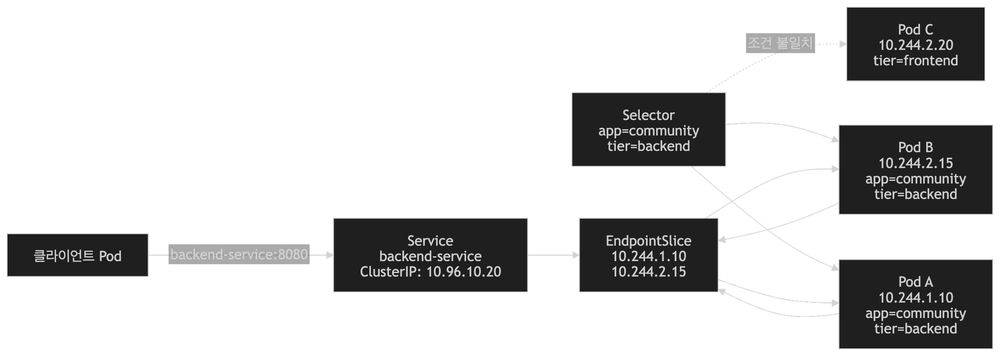
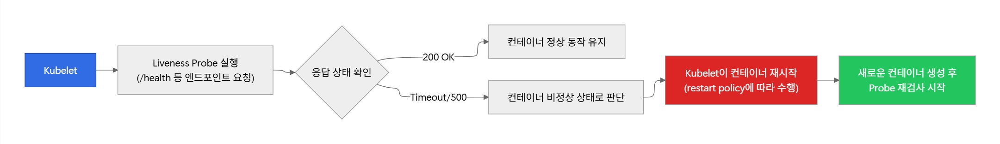

# 2026-07-15 TTL

## 스크럼
[스크럼 url](https://app.notion.com/p/adapterz/39d394a480618086abd1db69ff5aca83)

## 새로 배운 내용
### Service
- 파드집합에 대한 네트워크 엔드포인트를 생성하고, 클러스터 내부 또는 외부에서 해당 파드들에게 안정적으로 접근할 수 있도록 지원하는 쿠버네티스 리소스
- 서비스는 자주 ip가 변경되는 파드 앞에서 오랫동안 유지되는 가상의 ip 주소와 DNS 이름을 제공함.
  
#### 서비스로 내부 연결을 해결하는 방법

- 서비스의 역할
  - 클러스터 내부에서 변경되는 파드들에게 안정적으로 접근하게 하는 것이 서비스의 역할
1. 안정적인 접근 주소 제공
   - 클러스터 내부에 사용할 수 있는 가상IP가 만들어짐
   - 네임스페이스  
     - 분리되어 있는 가상공간
   - 서비스 DNS 구조
```
    [서비스명].[네임스페이스].svc.cluster.local
```

2. 여러 파드를 하나의 대상으로 추상화
3. 대상 Pod의 변경을 자동으로 반영
   - Selector
     - 조건에 맞는 파드 생성
     - 조건이 맞던 파드가 삭제나 조건이 더이상 맞지 않게 되면 서비스 대상에서 제외됨.

4. 여러 파드로 트래픽을 분산 시킬 수 있음.
   - Load Balancing이 네트워크 레이어(L4) 수준에서 됨.

#### 서비스 동작 구조


1. Pod에 Label을 붙임
2. Service에 Selector를 작성함
3. Selector와 일치하는 Pod를 찾음
4. 해당 Pod의 IP를 EndpointSlice에 기록함
5. Service로 들어온 트래픽을 backend Pod로 전달함

#### EndpointSlice
- 서비스가 현재 연결할 수 있는 실제 파드 IP 목록을 저장하는 리소스임.
- 서비스는 만들어지면 자체에 IP가 부여됨
- 예전 버전에서는 Endpoint라고 불렀음.

#### Service YAML 구조
``` yaml
apiVersion: v1
kind: Service
metadata:
  name: community-service
spec:
  selector:
    app: community
    tier: backend
  ports:
    - protocol: TCP
      port: 80
      targetPort: 3000
```

- Pod에는 lable, Service에는 selector
- port: 클러스터 내부에서 **서비스**가 요청을 받을 때 사용하는 포트
- targetPort: 연결 대상 **Pod**에서 사용하는 포트


#### Service 타입
##### ClusterIP
- 클러스터 내부에서만 접근 할 수 있는 **기본 타입**
- 클러스터 IP는 내부 IP를 서비스를 통해서 노출하여 내부에 있는 파드들에게 요청을 전달함. 
- 클러스터IP 형 서비스만 만들면 외부에서 접근이 불가능함.

##### NodePort
- 각 노드들의 특정 포트를 열어서 클러스터 외부에서 Service로 접근 할 수 있게 하는 타입
- 외부에서 접근 할 때 http://3.3.123.133:1231
- Node Port open + ClosterIP
- 사용사례
  - 실습할 때나 테스트 할때
- 왜 자주 사용하지 않을까? 
  - 모든 유저가 퍼블릭 IP와 포트 번호를 모두 사용해야해서 관리측면과 보안측면에서 적절하지 않음.

##### Load Balancer
- 클러스터 IP + Load Balancer 형태
- alb와 svc를 연결하는 setting이 상당히 까다로움. (eks를 사용하면 그나마 쉬움.)

##### Service 타입의 선택 기준
```text
클러스터 내부 통신인가?
        │
        ├── Yes → ClusterIP
        │
        └── No
             │
             ├── 간단한 실습·임시 노출 → NodePort
             │
             └── 클라우드 외부 노출 → LoadBalancer (EKS)
```

#### Service가 하지 않는 일
- 서비스는 파드를 생성하지 않음. 생성하는 것이 아니라 조건에 맞는 pod를 연결하는 것
- 서비스가 URL 경로로 라우팅하지 않음.

#### 실무 팁
1. 서비스가 동작하지 않으면, 엔드포인트와 DNS 문제를 확인해라
- 서비스는 그냥 고정된 이름을 제공하는 역할이여서, 연결이 안되어 있으면 서비스 문제가 아니라 다른 곳의 문제일 수 있음.

2. Service Target Port와 Pod Container Port
3. Service Selector는 변경할 때 조심
4. NodePort 실습 위주로만, 운영 환경에서는 X
- 보통은 Ingress, API Gateway를 선호함.

### Probe
- 컨테이너의 상태를 주기적으로 진단하는 메커니즘
- Label과 selector에 더해서 Probe로 healthy한 pod들만 연결함.
- 필요한 조치를 자동으로 수행해서 안정성과 가용성을 보장하는 핵심요소

#### Probe 필요한 이유
- 컨테이너는 실행하고 있다고 해서 정상처리를 할 수 있는 것이 아님.
  - 데드락
  - 내부 스레드 정지
  - 무한 루프
  - 데이터베이스 설정이 끊기는 경우 등등

| 확인해야 하는 상태 | 확인 질문 |
| --- | --- |
| 시작 상태 | 애플리케이션이 정상적으로 시작되었는가? |
| 생존 상태 | 애플리케이션이 멈추지 않고 계속 동작하고 있는가? |
| 준비 상태 | 지금 사용자 요청을 받아도 되는가? |

- Startup Probe
  - 애플리케이션이 초기화 과정이 완료 되었는지 확인
  - 초기화 시간이 긴 애플리케이션
    - 스프링, DB
- Liveness Probe
  - 앱이 정상적으로 실행 중인지 **지속적으로** 확인
  - 비정상 상태로 확인하면 자동 복구 트리거를 실행함.
- Readiness Probe
  - 앱이 사용자 요청을 처리할 준비가 되어있는지 점검
  - 준비되지 않은 상태인데 트래픽이 유입되지 않게 방지하는 것.

#### 프로브 진단법
1. httpGet(가장 흔한 방식)
   - 특정 URL 경로로 **HTTP 요청**을 보내는 것
   - 응답이 2xx이면 정상으로 판단
2. tcpSocket
   - 특정 포트에 **TCP 연결**을 시도해서 성공하면 정상으로 판단
   - WAS말고 소캣 연결이 필요한 파드 같은 경우 HTTP로 확인할 수 없음.
3. exec
    - 컨테이너 내부에 **특정 명령어**를 실행함.
    - 명령어 종료코드가 0이면 정상으로 판단

#### Kubelet, Probe
- 워커 노드에 상주하는 Kubelet이 주기적으로 컨테이너를 확인하는 것이 probe


#### Probe 사용방법
- 필드에 프로브를 정의하여 컨테이너 상태를 주기적으로 검사하도록 설정
  
##### 1. Liveness Probe
   - 죽었는지 보고 죽었으면, kubelet이 해당 컨테이너를 재시작을 시도함.
   - 핵심 역할
     - 데드락 탐지
     - 겉으로는 살아있는데 사실은 멈춰있을 때,
     - CPU는 열심히 사용해서 정상적으로 보이는데, 정작 API 요청에는 응답하지 않음.

##### 구현 시 주의 사항
1. 로직 단순화
   - 라이브니스 프로브는 주기적으로 요청을 보내기에 로직이 복잡하면, 점검 자체가 리소스를 낭비함.
2. 일시적 장애를 고려 (Flapping 고려하기)
   - periodSeconds, failureThreshold 잘 설계
   - Probe 주기를 너무 짧게 설정하면, 잠깐 바빠서 응답이 느렸는데 이걸 죽여버림.
   - 가용성과 처리량이 안좋아짐.
    - 실무적으로 튜닝
      - 앱 부팅 시간보다 여유있게 설정해야함.
      - StartUpProbe가 없으면 좀 더 길게 하는 것이 좋음
      - failureThreashold
        - 보통은 3~5번 정도로 기준을 잡음.
      - Period
        - 주기를 길게 설정(10~30초)
      - timeout
        - 일시적으로 트래픽이 몰리면 응답 시간 지연이 가능해서 여유롭게 설정하는 것이 좋음
        - p95시간 1000ms
        - avg 시간 200ms
        - p95 * 3~5 = 3000~5000ms (AWS 기준)

##### 2. Readiness Probe
- 준비되어 있지 않다고 판단되면 Pod를 Service에서 제거함
- 애플리캐이션이 살아 있는데, 초기화 중이거나 일시적으로 못받는 상태이면 서비스에서 제외 시키는 것임. (Endpointslices에서 제거)
- Readiness Probe가 없으면 무중단 배포를 못함.

##### Liveness vs Readiness
| **구분** | **Liveness Probe** | **Readiness Probe** |
| --- | --- | --- |
| **목적** | **지속적인 생존 확인** (Is the app healthy?) | **트래픽 처리 준비 확인** (Is the app ready for traffic?) |
| **실패 시 행동** | **컨테이너를 재시작 (Restart)** | **서비스 목록에서 제외 (Stop Traffic)** |
| **사용 사례** | **데드락** (Deadlock, 무한 루프) 발생 시 | **롤링 업데이트** 또는 **DB 연결 대기** 중 |
| **비유** | **심장 박동 확인** (멈추면 심폐소생술) | **영업 준비 완료 확인** (안 되면 문 닫음) |

- 보통 둘 다 WAS에 필요해서 같이 사용함.
- 의문: 그런데 동작이 살아있나 죽어있나 판단하는 것들인데 왜 구분하여 사용하고 있나요? 원리는 같은데. -> 이후 강의를 보면서 생각한건데 가볍게 여러번 체크와 무겁게 가끔 체크하기 위해서 나눈건가요?


##### Startup Probe
- 초기화가 오래걸리는 컨테이너에 사용
- liveness 오작동을 막는 용도로도 사용
  - 프로젝트가 커지면 스프링 부트를 초기화하는데 오래걸림 (2~3분)
  - 라이브니스 프로브는 기본적으로 10초 단위로 실행됨. 
  - 이러면 재시작을 무한 반복할 수 있음.
- startup Probe
  - 앱이 초기화 될때까지 liveness probe는 멈춤

#### Web 서비스에서 선택하는 표준

| **파드 종류** | **Startup** | **Liveness (생존)** | **Readiness (준비)** | **핵심 전략** |
| --- | --- | --- | --- | --- |
| **Frontend** | X | **HTTP** (`/`) | **HTTP** (`/`) | 단순하게 (켜지면 바로 투입) |
| **Backend** | **O** (느리다면) | **HTTP** (`/live`) *(DB 체크 금지)* | **HTTP** (`/ready`)*(DB 체크 필수)* | **이원화** (살아있는 것과 일할 준비된 것을 구분) |
| **Database** | O | **TCP** / **CMD** *(보수적 설정)* | **CMD** (`SELECT 1`) | **신중하게** (재시작은 최후의 수단) |

### QoS classes
- Pod의 CPU·메모리 requests와 limits 설정을 기준으로 Kubernetes가 Pod를 분류하고, 노드 자원이 부족할 때 어떤 Pod를 우선 보호하거나 퇴출할지 판단하는 기준

1. Guaranteed: 필요한 자원을 확실하게 확보하여 가장 강하게 보호받는 Pod
2. 최소 자원은 요청하지만, 여유가 있으면 추가적으로 자원을 사용하는 2인자 Pod
3. 자원을 따로 요청하지 않고 여분의 자원을 사용하는 보호받지 않는 Pod

- 사용자가 직접 이름으로 설정하는 것이 아니라 Pod에 작성한 CPU, Mem 설정을 보고 쿠버네티스가 자동으로 결정해주는 것임.

#### 사용하는 이유
- 하나의 워커 노드에서 여러 파드가 자원을 나누어서 사용하는데 자원이 부족하면 모든 파드가 죽어버려서 중요도를 분리해서 먼저 죽일 것을 설정하는 것.

#### Requests, Limits
##### Requests
- Pod를 실행하기 위해서, 쿠버네티스에 요청하는 최소한의 자원
```
resources:
  requests:
    cpu: "250m"
    memory: "256Mi"
```
- CPU 250 = CPU 코어의 25%

##### Limits
- 컨테이너가 사용할 수 있는 최대한의 자원 한도
- CPU에서 limits를 넘기면 사용을 제한함
- Mem에서 limits를 넘기면 OOM으로 컨테이너가 kill됨.

#### QoS Class 종류
##### 1. Guaranteed
- 컨테이너의 CPU, Memory의 Request,Limit를 동일하게 설정한 파드
- Request, Limit 설정 + (Request = Limit)
- 중요한 시스템이나 안정적인 성능이 필요한 파드들을 배치함. (결제, 인증 등등)
- 예상 자원 사용량이 비교적으로 명확한 앱에 적합하고 급격한 처리량 변화하는 앱에는 적합하지 않음.
- 하나의 노드에 모든 파드가 전부 guaranteed가 되지 않도록 affinity라는 것을 설정함.
- QoS Class만으로 퇴출 순서를 못정함. 그래서 Pod Priority가 있음.

##### 2. Burstable 
- 일부 자원은 보장을 받지만, 노드에 여유가 있으면 요청량보다 많은 자원을 사용할 수 있는 Pod
- Request나 Limit가 설정되어 있고 guaranteed 조건에 맞지 않음.
- 특징
  - 여유 자원이 있으면 request보다 많이 사용할 수 있음.
  - WAS 버스터블 클래스를 일반적으로 설정함.

##### 3. BestEffort
- CPU, Mem의 Request, limit를 설정하지 않음.
- 특징 
  - 스케줄러 요청 사항이 없음
  - 노드의 남은 자원을 자유롭게 사용함
  - 자원이 부족할 때 가장 먼저 퇴출 됨.
- 언제 사용하는지
  - 실패해도 문제없는 Pods
    - test pod, instance pod, debug pod
    - 개발 환경
    - 통계성 작업 등등

#### 퇴출 조건
1. Mem
2. Dick 공간 부족
3. PID
   - 노드에서 생성할 수 있는 프로세스 ID가 부족한 경우


### 오늘의 도전 과제와 해결 방법
- 도전 과제 1: 도전 과제에 대한 설명 및 해결 방법
- 도전 과제 2: 도전 과제에 대한 설명 및 해결 방법

### 오늘의 회고
- 오늘의 학습 경험에 대한 자유로운 생각이나 느낀 점을 기록합니다.
- 성공적인 점, 개선해야 할 점, 새롭게 시도하고 싶은 방법 등을 포함할 수 있습니다.

### 참고 자료 및 링크
- [링크 제목](URL)
- [링크 제목](URL)