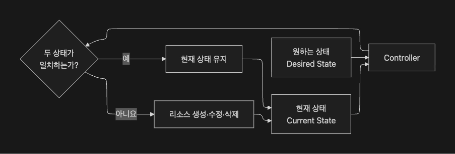
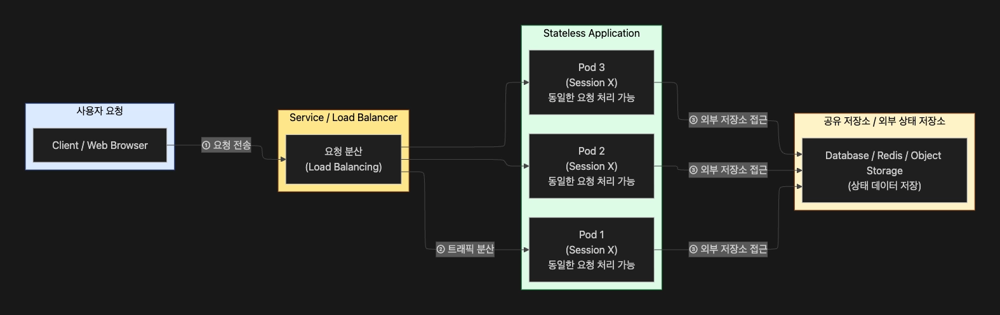

# 2026-07-21 TTL

## 새로 배운 내용
### Controller
- 클러스터의 현재 상태를 확인하고, 사용자가 선언한 목표 상태와 일치하도록 필요한 작업을 수행하는 제어 루프
- Pod는 Container처럼 일시적인 리소스여서 빈번하게 생성되었다 삭제되는데, 사용자가 직접 pod를 일일이 관리하는 것은 매우 번거로움

1. Desired State
- 클러스터 내에 목표로 하는 최종 상태
- 컨트롤러 yaml 파일에 적어둠.
  - spec.replicas:10

1. Current State
- 클러스터에 실제로 존재하는 상태
- 원하는 상태와 현재 상태가 일치하지 않으면 컨트롤러가 이 상태를 감지하고, 파드를 추가하거나 삭제함.

#### Control Loop

- Reconciliation

#### 핵심 역할
1. 원하는 상태를 유지
2. Auto Healing(자동 복구)
    - liveness probe를 파드가 중지하거나 실패하면 제거함
    - 원하는 상태로 돌아가기 위해서 자동적으로 복구함.
3. 자동확장 축소
4. 쿠버네티스의 선언적 관리

#### Pod와 Controller의 차이
| 구분 | Pod 직접 생성 | Controller로 Pod 관리 |
| --- | --- | --- |
| Pod 생성 | 사용자가 직접 생성 | Controller가 `Pod 템플릿`으로 생성 |
| Pod 삭제 시 | 그대로 사라짐 | 새로운 Pod 자동 생성 |
| 복제본 유지 | 지원하지 않음 | 지정한 수량 유지 |
| 확장·축소 | Pod을 직접 추가·삭제 | 목표 수량만 변경 |
| 장애 복구 | 운영자가 직접 처리 | Controller가 자동 처리 |
| 운영 적합성 | 단순 테스트·학습 | 지속적으로 운영할 애플리케이션 |

#### Pod Template
```yaml
spec:
  replicas: 3

  selector:
    matchLabels:
      app: web

  template:
    metadata:
      labels:
        app: web
    spec:
      containers:
        - name: nginx
          image: nginx:1.27
``` 
- Pod Template: 컨트롤러가 새로운 파드를 만들 때 사용하는 설계도

| 구성 요소 | 역할 |
| --- | --- |
| `replicas` | 유지할 Pod의 수 |
| `selector` | Controller가 관리할 Pod을 찾는 조건 |
| `template` | 새로운 Pod을 만들 때 사용할 설계도 |

#### Label, Selector가 중요함.
- 컨트롤러는 자기가 label로 관리할 파드를 모아두고 selector로 검색함.
- 컨트롤러는 모든 작업을 직접 수행하지 않음.
- API Server를 통해서 클러스터 상태를 확인하고 필요한 리소스를 생성, 수정, 삭제를 요청함.

1. 현재 파드의 수를 보고 API Server에 요청
2. pod template을 기준으로 만들어 달라고 요청
3. scheduler에서 노드 상태를 확인하고 이 파드를 배치할 노드를 고름
    - etcd에서 노드 상태 확인
4. API Server에서 워커노드에게 명령 전달 -> Pod 생성

#### Controller 종류

| Controller | 주요 목적 |
| --- | --- |
| **ReplicaSet** | 지정한 수의 동일한 Pod 복제본 유지 |
| **Deployment** | ReplicaSet을 관리하며 배포, 업데이트, 롤백 수행 |
| **StatefulSet** | 고유한 이름과 스토리지가 필요한 상태 기반 애플리케이션 관리 |
| **DaemonSet** | 조건을 만족하는 각 노드에 Pod을 실행 |
| **Job** | 완료를 목적으로 하는 일회성 작업 실행 |
| **CronJob** | 정해진 일정에 따라 Job을 반복 실행 |


### ReplicaSet
- label, selector로 관리할 Pod를 찾아, 사용자가 지정한 개수의 Pod가 항상 실행되도록 유지하는 Controller
- 특정 애플리케이션(컨테이너)의 동일한 사본(Pod)을 여러 개 실행하여 고가용성과 부하 분산을 보장하는 것

#### 사용처
##### Stateless Application
   
   - Label을 Selector로 확인하고 replicas로 정한 숫자와 비교만 해서 제어함.
   - Stateless Application일 때만 ReplicaSet을 사용함.
   - 컨트롤러는 label만 봐서 ReplicaSet을 추가하면 기존에 있던것도 포함될 수 있음.

#### ReplicaSet 한계
- 복제본의 수만 보고 있어서 image만 바꾼다고 자동으로 다음 버전으로 재배포되지는 않음.
- 즉, 새롭게 추가되는 파드들은 업데이트 해도, 현재 동작하는 파드들을 업데이트하지 않음. -> Pod의 수를 활용한 컨트롤 만으로는 부족함.
- 이를 해결하기 위한 Controller가 Deployment Controller

#### 주의사항
1. ReplicaSet이 파드를 고쳐쓰는건가?
    - 오토힐링: 수리가 아니라 삭제하고 재생성하는 것임. 
2. ReplicaSet은 파드가 부족할 때만 동작하는가?
    - 그러지는 않고 많으면 원하는 상태가 되도록 pod르 주리기도 함.
3. Probe랑 Controller가 같은 역할인가?
    - 프로브는 Container 레벨에서 복구하는 것
    - Controller는 Pod레벨의 복구
    - 보통 같이 사용함.
4. ReplicaSet이 트래픽을 분산하는가?
    - label은 매치되는 pod를 보고 복제본 수가 부족하면 만드는 기능일 뿐 그럿것을 지원하지는 않음. 
    - 그러한 기능은 service의 역할

#### Deployment
- ReplicaSet을 관리해서 Pod 개수와 애플리케이션의 배포, 업데이트, 롤백까지 자동으로 관리하는 상위 Controller임.
- ReplicaSet: 개수를 유지하는 것은 가능한데, 배포 작업을 편리하게는 하기 어려움.

#### 구조
- Deployment
  - 배포 관련 컨트롤러
  - ReplicaSet
    - 복제본 컨트롤러
    - Pod Template 
      - Pod
        - Container
```yaml
apiVersion: apps/v1
kind: Deployment

metadata:
  name: web-deployment

spec:
  replicas: 3

  selector:
    matchLabels:
      app: web

  template:
    metadata:
      labels:
        app: web

    spec:
      containers:
        - name: web
          image: nginx:1.27
          ports:
            - containerPort: 80
```

#### 사용이유
| 운영 문제 | 해결 방법 |
| --- | --- |
| Pod을 여러 개 유지해야 함 | ReplicaSet을 통해 복제본 유지 |
| 새로운 버전을 배포해야 함 | 새로운 ReplicaSet 생성 |
| 서비스 중단을 줄여야 함 | RollingUpdate로 순차 교체 |
| 배포에 문제가 발생함 | 이전 Revision으로 롤백 |
| Pod 수를 변경해야 함 | `replicas` 값을 변경해 확장·축소 |
| 배포 진행 상태를 확인해야 함 | Rollout 상태 제공 |
| 이전 버전 기록이 필요함 | 이전 ReplicaSet을 Revision으로 보관 |

#### Deployment로 업데이트 하는 법
1. Deployment yaml파일에 이미지를 버전 업하고 apply
2. deployment가 pod template에 있는 변경을 확인함.
3. 내용 변경이 확인되면 deployment가 새로운 ReplicaSet를 생성함.

#### Deployment 배포 전략
1. RollingUpdate: 기존 Pod를 새로운 Pod로 점진적인 교체진행
2. Recreate: 기존 Pod를 모두 삭제한 후 새로운 Pod를 생성

##### RollingUpdate YAML
```yaml
apiVersion: apps/v1
kind: Deployment
metadata:
  name: web-deployment

spec:
  replicas: 3

  strategy:
    type: RollingUpdate
    rollingUpdate:
      maxSurge: 1
      maxUnavailable: 1

  selector:
    matchLabels:
      app: web

  template:
    metadata:
      labels:
        app: web

    spec:
      containers:
        - name: web
          image: nginx:1.28
```

1. `maxSurge`
    ```yaml
    maxSurge: 1
    ```
- 업데이트 중에 원하는 복제본을 초과로 생성할 수 있는 파드의 수를 의미
- 개인적인 생각: 업데이트 하기위한 빈자리 느낌

2. `maxUnavailable`

    ```yaml
    maxUnavailable: 1
    ```
 - 업데이트 중 사용할 수 없는 상태를 허용하는 최대 파드 수를 의미
 - 개인적인 생각: 이미 사용하고 있는 자원이지만 곳 빈자리가 생기기에 중지되면 추가 할 같은 범위의 리소스를 소비하는 pod를 바로 넣기 위함인 듯? -> 굳이 필요한가? 조사가 필요해 보임.

#### Recreate
- 기존 Pod들 다 날리고 새로운 파드 생성하는 배포 전략
- 중단 배포
- 고려이유
  - 서비스 중단이 허용되는 환경, 두 가지 버전이 동시에 실행되면 안되는 경우 -> 은행, 게임

#### Deployment 에서 확인해야하는 항목

```
kubectl get deployment

NAME             READY   UP-TO-DATE   AVAILABLE   AGE
web-deployment   3/3     3            3           10m
```

| 항목 | 설명 |
| --- | --- |
| `READY` | 준비된 Pod 수 / 원하는 Pod 수 |
| `UP-TO-DATE` | 최신 Pod Template으로 생성된 Pod 수 |
| `AVAILABLE` | 사용 가능한 상태의 Pod 수 |
| `AGE` | Deployment가 생성된 이후 경과 시간 |

- ReplicaSet이 여러개 남아있어도 이전 버전으로 돌아가야할 수도 있으니 바로 삭제하지 않는 것이 좋음.

#### 실무 적용
1. Stateless App = Deployment를 사용해야함.
    - 개인적인 생각: 병렬성을 강조하는 기술은 다 Stateless에 적합하긴함.
2. 이미지 `latest`태그를 사용하면 안됨.
    - latest 태그만 사용하면 변경점을 찾지 못해서 업데이트가 안됨.
3. Controller와 Probe랑 같이 사용해야함.
4. 배포 상태 확인 
    - 배포가 항상 성공하지는 않기에 헬스체크 잘 걸어서 probe 설정하는 것이 좋음.


## 오늘의 회고
- 오늘 배운 것들이 그렇게 어렵다고는 생각되지 않는데 전체적인 그림이 상상이 안되는 것이 조금 문제인 것 같다. 이것저것 배웠는데 당일 복습한 것으로는 전체적인 그림이 명확하게 그려지지는 않아서 이를 정리하기 위해서 지금까지 배운 k8s를 정리하는 시간이 필요할 것 같다. 
- yaml파일의 상세한 내용이나, 명령어 같은 것을 백지 상태로 시작해서 작성할 수 있을지 의문이다. 개인적으로는 검색을 통해서 어떠한 것은 쓰고 어떠한 것은 쓰면 안되는지나, 원하는 기능의 원리를 알고 있어서 원하는 부분은 빼서 내 것으로 사용할 수 있는 능력이 필요하지 않나 싶다. 이를 목표로 계속 연습할 것이다.
