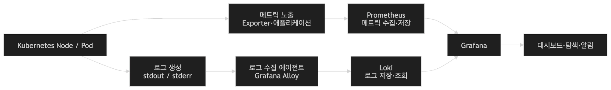

# 2026-07-28 TTL

## 스크럼
[]()

## 새로 배운 내용
## ArgoCD
- Git에 저장된 K8s 배포 설정을 기준(단일 진실 공급원)으로, 클러스터의 실제 상태를 지속적으로 비교하고 동기화하는 GitOps 기반 CD 도구임.
#### 기존 방식
- 배포를 사용자가 직접 명령어를 사용하면서 배포해야했음.
  - 따라서 사용자에 따라서 명령어 순서나 디테일이 달라짐.
  - 깃허브에 클러스터 상태를 Helm Chart로 기록하는데 이것이 실제 클러스터 상태와 일치하지 않을 수 도 있었음.

#### 사용이유
| 이유 | 설명 |
| --- | --- |
| 배포 자동화 | Git의 배포 설정이 변경되면 Argo CD가 변경을 감지하고 클러스터에 반영할 수 있습니다. |
| 상태 일관성 유지 | Git의 목표 상태와 클러스터의 실제 상태를 지속적으로 비교합니다. |
| 변경 이력 관리 | 배포 설정 변경이 Git commit과 Pull Request로 남습니다. |
| 복구 용이성 | 이전 Git commit으로 되돌린 뒤 다시 동기화할 수 있습니다. |
| 배포 상태 시각화 | Pod, Deployment, Service 등의 관계와 상태를 웹 UI에서 확인할 수 있습니다. |
| CI와 CD 분리 | CI는 빌드와 이미지 생성을 담당하고, Argo CD는 Kubernetes 배포를 담당합니다. |
| 클러스터 접근 최소화 | CI 서버가 직접 Kubernetes API에 접근하지 않아도 배포할 수 있습니다. |

#### GitOps
- Git에 선언된 설정을 시스템의 목표 상태로 삼고, 실제 시스템이 그 상태를 유지하도록 자동화하는 운영방식
- git에 등록된 설정파일이 운영 환경의 기준으로 사용되는 상태여야함.
```
Git 저장소
  └─ Kubernetes YAML / Helm / Kustomize
                  │
                  │ 목표 상태 확인
                  ▼
               Argo CD
                  │
                  │ 비교 및 동기화
                  ▼
        Kubernetes 클러스터
```

#### ArgoCD 핵심
1. Application: 어느 Git repository의 어느 설정을 어떤 K8S 클러스터와 네임스페이스에 배포할지를 정의함.
    - source, destination, syncPolicy
2. Sync: Git의 목표 상태를 클러스터에 넣는 작업
- Sync Status
    - Synced: Git과 클러스터 상태가 일치
    - OutofSync: Git과 클러스터 상태가 불일치
    - Unknown: 상태를 정상적으로 비교하지 못함.
- Health Status
    | 상태 | 의미 |
    | --- | --- |
    | `Healthy` | 리소스가 정상적으로 실행되고 있습니다. |
    | `Progressing` | 배포나 변경이 진행 중입니다. |
    | `Degraded` | 일부 리소스가 비정상 상태입니다. |
    | `Missing` | Git에는 있지만 클러스터에 리소스가 없습니다. |
    | `Unknown` | 상태를 판단할 수 없습니다. |

#### ArgoCD 동작 방식

```
1. 개발자가 애플리케이션 코드를 변경

2. CI가 테스트 및 이미지 빌드

3. 컨테이너 이미지를 Registry에 Push

4. Git의 배포 설정에서 이미지 태그 변경

5. Argo CD가 Git 변경을 감지

6. Git과 Kubernetes 상태 비교

7. Kubernetes 리소스 동기화

8. 배포 상태 확인
```

#### ArgoCO 특징
1. 선언적 배포
2. Pull 배포
    - 일반적으로는 CI 서버에서 배포 대상에게 Push를 진행함.
    - ArgoCD Pull 방식: CI까지 다 되면, k8s cluster이 ArgoCD Pod에 주기적으로 Polling으로 값을 가져오도록 함. 그래서 github에 있는 값이랑 클러스터 값을 비교해서 다를 경우 배포를 시작함.
3. Self Healing
    - Git의 정보를 단일 진실 공급원으로 생각하는데 이것과 다를 경우, 단일 진실 공급원이 정한 설정으로 다시 돌아감.
4. Prune
    - git과 cluster 상태를 일치시키려고 하기에 git에서 리소스 파일을 삭제하면 클러스터에서도 자동으로 삭제됨.
    - 운영에서는 위험해서 잘 사용하지 않음.
5. 자동, 수동 동기화
    | 환경 | 일반적인 적용 방식 |
    | --- | --- |
    | 개발 환경 | 자동 동기화를 적극적으로 사용할 수 있습니다. |
    | 스테이징 환경 | 자동 또는 승인 후 동기화를 선택합니다. |
    | 운영 환경 | Pull Request 승인과 수동 Sync를 조합하기도 합니다. |

## PLG
- Prometheus + Loki + Grafana
- p: 시스템의 수치 데이터를 수집과 저장
- L: 애플리케이션과 시스템의 로그를 수집 및 저장
- G: 데이터 소스에 질의해서 메트릭과 로그를 대시보드로 시각화하고 탐색

### 모니터링
- 시스템에서 발생하는 데이터를 수집해서 현재 상태를 확인하는 활동

### 관측성
- 외부로 내보내는 데이터를 이용하여 시스템 내부에서 무슨 일이 발생했는지 추론할 수 있는 능력
- Metrics + Logs + Traces
    | 관측성 데이터 | PLG 구성 요소 |
    | --- | --- |
    | Metrics | Prometheus |
    | Logs | Loki |
    | 시각화 및 분석 | Grafana |
    | Traces | PLG 기본 구성에는 포함되지 않음 |

### 사용 이유
1. 시스템에 상태를 한 눈에 보기 힘듦.
2. 파드는 삭제되면 임시 데이터를 같이 삭제함.
3. 장애를 찾기 힘듦.

### PLG Stacke 구조


### Prometheus
- 시스템의 수치 데이터를 수집과 저장
- 시계열 데이터
```
CPU 사용률: 72%
메모리 사용량: 512MiB
HTTP 요청 수: 초당 120개
에러 응답 수: 5분 동안 17개
API 평균 응답 시간: 350ms
```

#### Exporter
- 특정 시스템의 상태를 읽고 프로메테우스가 이해할 수 있는 메트릭 형태로 노출하는 프로그램.

#### PromQL
- 프로메테우스에서 사용하는 쿼리 언어
- 자주 사용하지는 않아서 외울 필요 없음. 그냥 gpt 써도 됨.

### Loki
- 애플리케이션과 시스템의 로그를 수집 및 저장

#### Loki 저장 방식
- 전통적인 로그 검색 시스템은 로그 본문에 있는 반복적인 단어들을 인덱싱 했음.
- 로키에서는 로그의 라벨을 중심으로 로그 스트림을 구분함.
- index: 레이블 조합과 해당 로그 Chunk의 위치
- chunk: 실제 로그 메시지와 타음 스탬프
- 인덱스에는 해당 레이블 조합의 로그는 어느 청크에 들어있는 가만 저장함.

##### 로그 본문을 왜 인덱싱하지 않는가?
- 인덱싱을 하기 위해서는 단어를 쪼개고 저장해야하는데 로그 전체를 다 쪼개서 인덱싱하기에는 너무 방대함.
- 대신 사용하는 방식
1. 적은 수의 레이블로 검색 범위를 좁힘
2. 해당 레이블에 연결된 청크를 찾음
3. 청크 안에 있는 로그 내용을 필터링

장점
- 인덱스 크기가 그렇게 커지지 않음
- 로그 본문의 압축률이 좋음.
단점 
- 설계하기가 어려움.
  - 압축률을 높이는 설계를 하려면, 발생하는 로그의 형태와 위치를 파악해야함.
- 레이블을 잘못 만들면
  - 인덱스는 엄청 커지고 내부의 청크는 엄청 작아짐.

#### 레이블 설계 팁
- 좋은 레이블의 특성
1. 값의 종류가 적음.
2. 값이 오래 유지됨.
3. 로그 출처나 운영 범위를 구분함.
4. 쿼리할 때 자주 사용함.

### Grafana
- 데이터 소스에 질의해서 메트릭과 로그를 대시보드로 시각화하고 탐색하는 도구.

#### 사용 이유
1. 직관적인 상태확인
2. 통합 조회
3. 장애 분석
4. 대시보드 공유
5. 알림 구성


## 오늘의 회고
- 오늘 배운 것이 이해가 잘 되지 않은것 같지만 사용하다보면 이해가 될 것 같아서 복습하면서 다시 이론 정리 한 것으로 만족하였다.