# 2026-07-29 TTL

## 스크럼
[07-29 스크럼](https://app.notion.com/p/adapterz/3ab394a48061800881aae3d105eff16f)

## AutoScaler
### HPA
- 애플리케이션의 부하를 메트릭으로 관찰하고 Deployment와 같은 워크로드의 Pod 개수를 자동으로 늘리거나 줄이는 기능

#### 사용이유
- Deployment로 인해서 Pod의 수는 고정되어 있음. 현재 트래픽을 기준으로 replicas 숫자가 변경되지 않음.
- 갑자기 트래픽이 몰리면 이에 맞춰 Pod수를 증가시켜야함.

1. 부하 대응을 자동화 하기 위해서
2. 트래픽이 감소한다면 파드를 줄일 수 있음.
   - 리소스가 고정이라서 파드를 줄일 필요없지만, 다른 파드가 늘어날 수 있기에 미리 자리를 만들어 두기 위해서 줄임.
3. 수동 운영을 축소하기 위함.
   - 일일이 replica의 값을 변경하는 것은 번거로우니 이를 자동화 

#### 구성 요소

| 구성 요소 | 역할 |
| --- | --- |
| 대상 워크로드 | HPA가 Pod 개수를 조정할 Deployment 등 |
| Metrics Server | 노드와 Pod의 CPU·메모리 사용량을 수집하여 Metrics API로 제공 |
| HPA 리소스 | 대상, 최소·최대 Pod 수, 목표 메트릭을 정의 |
| Resource requests | CPU·메모리 사용률을 계산할 때 기준값으로 사용 |
| HPA Controller | 메트릭을 확인하고 필요한 복제본 수를 계산 |

#### Metrics Server
- 각 Node, Pod의 현재 CPU,Mem 사용량을 수집하여 HPA, kubectl top이 사용할 수 있도록 제공하는 K8S용 메트릭 수집 애플리케이션
- 클러스터에 별도로 설치하는 애플리케이션으로, kube-system에 deployment형태로 설치가 됨
- 각 Node의 kubelet이 CPU,Mem의 사용량을 제공하면 Metrics API로 제공하는 방식임.
- Prometheus와 비슷하지만 다름.
  - Prometheus: 장기간 데이터를 저장하고 분석하는 모니터링 시스템
  - Metrics Server: 현재 리소스 사용량을 보여주는 API

#### request
- 사용량 기준은 현재 사용량에 request 비교해서 봄.
- HPA의 `averageUtilization`은 각 컨테이너에 설정된 CPU requests 대비 실제 CPU의 사용량 비율을 의미함.
```
CPU 사용률 = (실제 CPU 사용량/CPU request) * 100
```

#### 스케일링 속도 제어
- HPA가 부하 변화마다 Pod를 즉각적으로 수정하면, 변화에 너무 민감해지는데 Pod의 생성속도가 그 변화속도를 따라가지 못함. 
- 플래핑
- behavior에서 설정함.

#### ArgoCD를 사용한다면?
- ArgoCD는 git의 단일 질실 공급원과 일치하도록 수행하는데 k8s에서 pod을 자동적으로 늘렸다 줄였다하면 일치하지 않아서 ArgoCD는 git에 있는 설정에 맞추려함.
- HPA를 사용할 때는 워크로드의 복제본 관리 주체가 누구인지 명확학게 명시해야함.

##### 해결법
1. Deployment replicas 제거하고 복제본 관리는 HPA에게 맞기기 
    - 배포 설정에 필요한 Replicas는 Git + ArgoCD, 현재 필요한 Replicas는 HPA가 관리
2. ArgoCD spec.replicas 무시하는 방식
    - ArgoCD에 ignoreDifferences 설정해서 ArgoCD가 해당 차이를 OutOfSync로 판단하지 않도록 함.
    - RespectIgnoreDifferences=true 값을 적용해야함.
    - 클러스터를 처음 설치할 때는 비교대상이 없어서, replicas에 적힌 값을 그대로 적용 시킴.

#### 실무
- deployment replicas를 사용하지 않고 HPA replicas에서 관리함.
- ArgoCD에서도 replicas에 대해서 무시하도록 설정함.

### VPA
- Pod의 실제 CPU·메모리 사용 이력을 분석하여, 컨테이너의 적절한 requests 값을 추천하거나 자동으로 조정하는 오토스케일러
- HPA와 같이 추가로 설치해야하는 애플리케이션임.

#### 사용이유
- VPA는 실제 리소스의 사용량을 보고 분석해서 request를 다룸.
- 파드에 필요한 리소스를 실제 사용량에 가깝게 맞추는 RightSizing 도구
  - 자동화 기능을 넣으면, 파드를 request에 맞게 재배치도 함.
  - request를 변경해서 확장함.  

#### 구성 요소
1. Recommender: 파드의 사용량 분석해서 적절한 리소스 값을 추천
2. Updater: 실행 중인 파드의 요청값, 권장 값을 비교하여 변경이 필요한지 판단함.
  - Eviction 대상이면 제거함
  - recreate면 eviction이 발생함.
  - In-place면 eviction이 발생하지 않음.
3. Admission Controller: 새롭게 생성되는 파드에 VPA 권장 리소스 값을 주입하는 역할



#### 주의사항
1. Pod 재생성 가능성을 고려해야함.
- VPA가 In-place가 가능하긴하는데 Eviction이 디폴트라고 보면 됨.
- replicas: 1로 사용하면 VPA Eviction 때문에 문제가 생길 수 있음.

2. VPA StatefulSet과 어울리나
- DB가 master,Slave 하나씩 statefulSet으로 구성되어 있으면 VPA로 구성하기에는 애매함.
- DB master가 Eviction으로 재생성이 될 때까지 오래걸리기에 서비스 전체의 쓰기가 불가능해짐.
  - 그래서 3 master정도일 때 VPA를 적용할 수 있음.
  - 강사님은 Stateful이 k8s 내부에서 관리하기 힘들어서 사용할 이유가 없으면 권하지 않음.
    - 데이터베이스의 종류가 상당히 다채로울 때 사용 할 수 있음.
    - Mysql,Maria, Mongo, Redis, Graph, VectorDB

3. minAllowed, maxAllowed 사이징을 잘해야함.

#### 실무
1. 추천 도구로만 사용한다. 
  - Pod request를 변경하기 위해서 파드를 삭제했다 만드는 것은 너무 리스크가 큼. 차라리 수평확장이 안정적임.
  - 의문점: 삭제하지 않는 기능인 In-place를 사용하면 해당 리스크가 없는데 괜찮은 것 아닌가?
2. Initial로만 적용한다.

### CA 
- Cluster Autoscaler
- pod을 배치할 공간이 부족하면 워커노드를 늘리고, 불필요한 노드가 생기면 줄이는 노드 단위의 자동 확장 도구
- pod를 노드에 스케줄링이 가능한지 확인을 하여, pending 상태가 많으면 이를 보고 노드 확장을 고려함.
    - pending pod 수
    - 각 파다가 필요한 request의 양을 보고 CA가 결정함. (추가로 필요한 request의 양이 적으면 무시할 수 있음. )

- 파드를 늘릴 때 배치할 노드가 없으면, 새로운 노드 자체를 새롭게 추가해서 클러스터에 배치하는 방식

#### CA는 직접 노드를 추가하지 않음.
- AWS Auto Scaling Group (ASG)
  - 현재 필요로 하는 Node의 수만 변경하는 것이지 직접 Node를 추가하는 것은 아님.
- Karpenter
  - CA 툴이기에 직접 EC2 템플릿을 골라서 생성 요청함.
  - 장점: 조금 더 생성시간이 빠르고, 예민하게 움직일 수 있음.
  - 단점: 설정하기 상당히 까다로움.
- ASG Desired Capacity를 증가시켰다고 ec2가 바로 생성되지는 않음.
  - CSP의 한계
  - IDC 물리적인 장비를 가지고 서비스하기에 추가할 때 생성 대기 시간이 생길 수 있음.

#### Node가 줄어들 땐 어떻게 동작하나
- 다른 노드로 가지고 있는 Pod의 이동이 가능한가
- 이동할 노드에 리소스가 충분한가
- 스케줄링 조건을 만족하는가
- 안전하게 퇴거 가능한가
- 로컬 데이터가 있는가

#### kubeadm CA 연동
- 인프라 레벨에서 CA 동작을 하려면 인프라 프로비저너가 필요함
- 워커 노드에 필요한 것들
  - containerd
  - cni
  - kernel
  - sg
  - 위의 작업들을 해주는 것을 인프라 프로비저너
    - 이래서 EKS가 아니면 CA를 사용하기 힘들다고 생각하면 됨.
    - 하지만 안되지는 않지 ㅎㅎ 돈 아끼기 위해 하는 방식

#### 사용법

1. 워커 노드용 AMI 준비
2. 새 노드가 k8s 클러스터에 join 할 수 있게 해야함.
3. ASG
4. AWS 권한 부여하기 

#### 현실적인 구성
1. kubeadm + 노드를 수동 관리 (CA 사용X)
2. kubeadm + ASG + Cluster autoscaler
   - 설정이 복잡하지만 베어메탈 환경에서 k8s 구동한다면 해야함.
3. `EKS + CA (Karpenter)`
   - AWS CSP


## 의문점
Q: In-place를 사용하면 Pod를 삭제하지 않아도 되어서 VPA의 큰 단점을 없앨 수 있다고 생각되는데 그럼 HPA뿐만 아니라 VPA도 사용할 수 있는 것 아닌가?

A: 이전에는 Scheduler가 request하나만 보아서 수정을 했으면 생성하다가 문제가 발생할 수 있었음. 하지만 버전이 커지면서 desired, allocated, actual 상태 관리를 하게 되었고 이를 통해 request 수정이 가능해졌음. 그럼 상대적인 단점은 이전보다 관리할 것이 많아져서 리소스를 많이 차지한다는 단점이 있음. 그런데 HPA은 평형적으로 확장하는 것이기에 네트워크관리, 특히 트래픽 분산 및 라우팅 테이블 관리가 상대적인 단점이 될 수 있음. 그럼 HPA와 VPA 반반 섞어서 사용하는 것도 나쁘지 않을 것 같은데?
- 실무에서는 사용하지 않는 이유가 k8s의 다양한 버전이 있는데 최근부터 지원되는 기능이라 큰 프로젝트에 다양한 k8s 버전이 있는 기업에서는 적용하기에는 아직 안정성이 떨어져서 사용하지 않는 것인가?

## 오늘의 회고
- 오늘 배운내용이 쉽다고는 하지만 설정이 복잡해 보여서 머리가 아프다. 이것을 설정하려면 여러가지 고려사항들을 생각하면서 설계해야하기에 어려운 것 같다.
