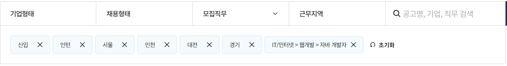

# TIL Template

# 날짜: 2026-06-02

## 스크럼
- 학습 목표 1 : [스크럼 notion url](https://app.notion.com/p/adapterz/373394a48061800397bcfe085b0735e8)

## 새로 배운 내용
### 기본 값 타입

- 자바의 기본 자료형으로 엔티티 필드로 선언
- null값이 들어갈 수 있으면 래퍼클래스로 아니면 기본 자형으로 (Integer , int같은 것들)

2. 임베디드 타입
- DB에 테이블이 연결되는 것이 아니라 Entity만 연결하는 것임. DB에 직접적인 영향 X

컬렉션 값 타입
-엔티티에 직접 연관되지 않는 

Long값에 null이 저장되는 이유
- long은 기본형으로 stack에 값이 저장되는 것인데
- Long은 stack에 참조형으로 주소값이 저장되기에 힙에서 값을 참조하는 방식임. 

### JPQL
- 엔티티 객체를 대상으로한 쿼리 언어 즉, 객체지향 쿼리 언어

JPA의 특징 
- 단일 엔티티 관리는 쉬움.
- 복잡한 쿼리나 조건, 대용량 데이터는 처리가 어려움.

=> 이를 해결하기 위한 JPQL
- DB레벨에서 데이터 처리 성능이 유리함

#### 특징
- 문법은 MySQL이랑 상당히 유사한 듯. (다른 DB들의 문법은 몰라서 확실친 않은데)
- SQL이 아닌 엔티티 중심의 쿼리언어
- 엔티티 모델을 기준으로 JPA 구현체가 사용하는 DB에 맞게 SQL 문 작성 -> 이게 JDBC와 비슷하지만 다른 점인듯

```SQL 
select 별칭
from 엔티티명 별칭
where 조건식
group by 그룹핑기준
having 그룹핑조건
order by 정렬기준
```

JPQL에서 조인을 하게 된다면 명시적 조인을 권장

- JPQL를 쓰는 이유는 복잡한 쿼리문도 효율적으로 쓰기 위함인데, 그럼 JPQL를 적용하는 곳은 복잡한 쿼리인 경우가 대부분.
- 그래서 묵시적 조인을 사용하면 가독성이 떨어짐.

N+1문제 해결 (N+1문제는 0601에 있음)
- fetch join으로 엔티티 한 번에 가져옴.
- N+1문제 해결 , 필요한 데이터 미리 로딩
- 페이징이 불가능함. 필요 이상의 데이터 

#### Projection
1. 엔티티 프로젝션
- 엔티티 타입을 결과를 받는 방식

2. 임베디드 타입 프로젝션
- 임베디드 타입을 결과로 받는 방식

3. 스칼라 타입 프로젝션
- 숫자,문자열,날짜 같은 스칼라 지정조회

4. DTO 프로젝션
- 필요한 필드를 DTO로 만들어서 DTO 생성자를 통해 결과값을 가져옴.

### Spring Data JPA

- 반복전인 CRUD 코드없이 인터페이스만으로 리포지토리를 구현
```java
@Repository
public interface 리포지토리명 extends JpaRepository<엔티티, ID> {
}
```
- Query Method : 메서드 이름을 기반으로 JPQL 쿼리를 자동으로 생성하는 기능

#### 사용처
1. 간다한 조회에 적합 (너무 길어지면 이름이 뒤지게 길어져서 오히려 가독성이 떨어짐)
2. 복잡한 조건, 동적 쿼리는 JQPL이 오히려 편함
3. 코드 가독성 + 생산성이 향상됨.
4. 메서드 이름만으로 실행될 쿼리 이해가 가능함.

#### @Query
- 메서드 이름으로 표현하기 어려운 쿼리나 너무 복잡할 때 사용함.
- JPQL를 사용하여 메서드의 동작을 설정할 수 있도록 해줌. 

#### @EntityGraph
- 특정 엔티티 조회시 함꼐 로딩할 연관 엔티티를 지정함.
- N+1문제 방지 하지만 자주 사용되지는 않음. 보통 @Query를 통해 해결됨.


#### @Pagealbe
- Spring Data JPA에서 페이징과 정렬을 손쉽게 처리할 수 있도록 제공하는 객체

1. Pageable
```java
Pageable pageable = PageRequest.of(0, 10, Sort.by("id").descending());
```

2. Page

```java
Page<User> findAll(Pageable pageable);

// Page 사용 (예시)
Page<User> page = userRepository.findAll(pageable);
page.getContent().forEach(u -> System.out.println(u.getNickname()));
```

#### 사용자 정의 리포지토리
- Spring Data JPA에서 제공하는 기능으로 구현이 불가할 때 사용 (그정도의 일이 있나?)

1. 커스텀 인터페이스 만들기
2. 구현 클래스 작성하기
3. 레포지토리에 상속하기


### QueryDSL

- 자바 코드로 JPQL이나 SQL 같은 쿼리를 직접 작성하지 않고, 메서드 호출과 객체 지향 문법을 이용해 쿼리를 표현할 수 있도록 해주는 객체지향 쿼리 라이브러리

- JPQL의 단점: 엔터티 변경 시 에러발생 -> JPQL 동적 쿼리로 해결.(JPQL이 결국 문자열 기반이기에 조건문을 통해 문자열을 변경시키는 방법)

- JPQL 동적 쿼리의 단점 -> 오타 시 컴파일 에러로 탐지가 안돼고 런타임 에러가 발생함. + IDE에서 자동완성이 힘듬.

- 개인적인 생각: 그럼 DSL은 사용자가 직접 쿼리의 조건을 변경하면서 검색하고 싶을때 적합하겠네?

ex)


#### 예시
1. JPQL
```java
select u from User u where u.name = :name 
```

2. QueryDSL
```java
QUser.user.name.eq("pappus")
```

#### Q클래스

Entity -> 메타 모델 클래스 -> Q Class 

- QuerydslConfig

```java
@Configuration
public class QuerydslConfig {

    @PersistenceContext
    private EntityManager entityManager;

    @Bean
    public JPAQueryFactory jpaQueryFactory() {
        return new JPAQueryFactory(entityManager);
    }
}
```

#### BooleanBuilder
- 여러 조건을 조립하거나 동적으로 추가할 때 사용하는 방식

```java
JPAQueryFactory qf = new JPAQueryFactory(em);
QUser u = QUser.user;

BooleanBuilder where = new BooleanBuilder();
if (name != null)       where.and(u.name.contains(name));
if (joinedAfter != null) where.and(u.joinedAt.goe(joinedAfter));
if (active != null)      where.and(u.active.eq(active));

List<User> users = qf.select(u)
                     .from(u)
                     .where(where)
                     .fetch();
```

#### where 다중 파라미터

- where()절에 여러 조건 메서드를 파라미터로 전달하여 작성하는 방식 (null인 조건은 자동으로 무시함.)
- BooleanBuilder: 조건이 많아지면 코드가 길어져 가독성이 떨어짐


```java 
List<Post> result = queryFactory
        .selectFrom(post)
        .where(titleEq(title), authorEq(author), statusEq(status))
        .fetch();
```

### 오늘의 회고
- QueryDSL이라는 것은 처음봐서 신기했다. 동적 쿼리를 작성할 일이 없었어서 한번도 사용하지 않았는데 이번 기회에 많이 사용해보고 싶다.
- 또한 @EntityGraph도 처음보는 어노테이션이였는데 왜 그런지 알 것 같다. 그냥 Eager과 똑같아서 LAZY로 구현하고 Eager처럼 쓰는 것 같다.
- 오늘은 진도가 빨랐다 느렸다 하는 것 같았는데 내가 배운것이 있었다 없었다해서 그런 것 같다. 느릴때는 이전에 놓친 부분을 학습하여 진도를 맞추는게 좋은것 같다.
