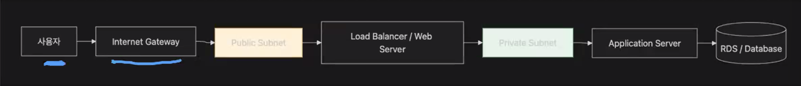
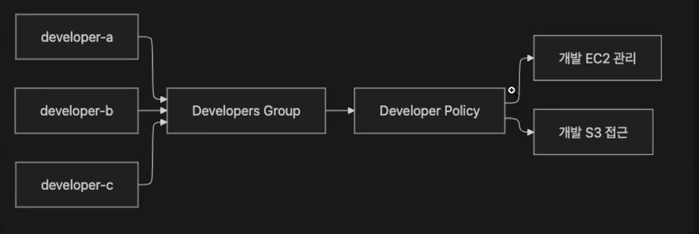

# TIL Template

# 날짜: 2026-06-22

## 새로 배운 내용
### vpc
- aws 내에 논리적으로 분리되어 있는 가상의 네트워크
- 서버와 데이터베이스를 무작정 인터넷에 연결하지 않고, 서비스별 통신 경로와 접근 범위를 통제하기 위해 사용



- CIDR 블록 -> 보통 VPC 만들 때 가장 먼저 지정하는 값이 IPv4 CIDR 블록임.

- DNS 옵션, 테넌시

1.
2. subnetting

AZ(Abillity Zone)
- AWS가 전세계적으로 퍼져있는 데이터센터를 갖고 있으면서 컴퓨팅 자원을 가상화해서 대여하는 서비스
- 보통 서브넷을 나눌 때, 최소 한,두 개 이상의 AZ에 분배되도록 구성함. -> 대신 돈이 두배로 듦.


퍼블릭, 프라이빗 서브넷
- 해당 서브넷 라우팅 테이블에 인터넷 게이트 웨이 경로가 있냐 없냐로 나눔.

4. 라우팅 테이블
5. 인터넷 게이트웨이
- VPC랑 인터넷을 연결하는 출입구
6. NAT Gateway
- 프라이빗 서브넷에 있는 서버가 외부 인터넷으로 나갈 수 있지만, 인터넷에서 먼저 들어오는 연결을 막는 장치 (NAT의 특징을 사용한 Gateway인 듯.)

VPC 주의사항
1. 퍼블릭 IP 할당에는 주의
- 퍼블릭 IP 할당 받은 갯수로 과금.
- 퍼블릭 IP를 할당받은 인스턴스가 동작하지 않으면 과금됨 (다른 사람이 해당 IP를 할당할 수 없어서 그런듯)

2. 퍼블릭 IP 내부 서비스 할당
- RDS, Cache를 퍼블릭 IP로 할당하면 외부에서 접근이 가능하기에 위험함.

3. SSH열 때, 0.0.0.0/0
- 모든 명령어들을 수행할 수 있기에 pem키 나한테만 있다고 열어두면 위험하다.

4. VPC 할당할 때, 설계
- 내가 내 서비스에 구성요소들을 어디에 둘지를 고민해야함.

5. NAT Gateway 조심해야함.
- NAT Gateway가 상당히 비싸다. (과금 구조가 네트워크 통신량임.)
- 이미지를 다운받거나 깃허브 clone을 하면 돈 많이 깨짐.

### IAM
- AWS 리소스에 대한 사용자 인증과 권한 관리를 제공하는 서비스
- 인증: 사용자, 역할, 로그인 방식 ,MFA 확인
- 인가: AWS 서비스,리소스.API별 권한 확인

### IAM 권한 배분 원칙
최소 권한 원칙
- 필요한 작업을 수행할 때, 필요한 최소한의 권한만 부여하는 보안 원칙
- root user로 하지말고 권한이 제한된 IAM user로 접근하는 것에도 익숙해지는 것이 좋음

#### GROUP
- 그룹은 여러 IAM 유저에게 같은 권한을 한 번에 할당할때 사용함.


- Developers, Operators, ReadOnlyAuditors, BillingAdmins로 보통 설정함.

#### Policy
- AWS에서 어떤 작업을 허용할 지 정하는 규칙
- IAM 정책은 보통 Effect,Action,Resource,Condition.

#### Role
- IAM user, AWS 서비스 특정 권한을 임시로 빌려서 사용할 수 있도록 하는 권한 묶음.
- 예시) 파일 업로드할 때 Role를 설정하는데 BackendFileUploader라는 Role을 설정해서 Policy에 연결해서 원하는 권한을 설정함.
- Policy를 묶어서 세트로 권한을 부여하는 느낌임.

#### MFA
- 멀티 팩터 인증
- 비밀번호 외에 인증 수단들로 로그인을 할 때 사용하는 인증 수단.

### 보안그룹

### Route 53
- AWS에서 제공하는 DNS 서비스
- 도메인 구매처에서도 DNS를 제공하지만, AWS 서비스랑 유기적으로 연결이 안되어 있다.
- 글로벌 위치기반 호스팅 제공

#### Hosted Zone
- 특정 도메인 <- 서브 도메인에 대한 DNS 레코드를 보관하고 관리하는 공간

1. Public Hosted Zone
- 인터넷 전체에서 조회할 수 있는 호스트
- 외부 DNS 조회가 가능함.

2. Private Hosted Zone
- VPC 내부에서만 조회가 가능함.
- 내부 DB, 사내 API 
- 외부 DNS에서 조회가 안됨.
    - 데이터베이스 인스턴스를 늘렸다 줄였다 하면 ip가 바뀜
    - 이때 Private Hosted Zone을 사용해서 domain으로 찾도록 application.yml을 만듦.
    - ip로 찾지 않기에 ip가 계속 바뀌어도 찾을 수 있음.

3. Name Server Record
- 이 도메인의 DNS 설정은 어디에서 관리하는지 알려주는 레코드

4. SOA 
- Start of Authority
- DNS 영역에 대표 네임서버와 관리, 갱신 정보를 담는 레코드

#### DNS 레코드
- 도메인에 접속하려면 어디로 연결되어야 하는지 알려줌.

##### A 레코드
- 도메인을 IPv4 주소로 연결함.
- AWS 내부에서 고정된 ip를 사용하는 경우

##### CNAME
- 한 도메인의 이름을 다른 도메인 이름에 연결
```
www.example.com -> example.com
```

##### Alias 레코드
- Route 53에서 AWS 리소스를 도메인에 직접 연결하기 위한 AWS 전용 DNS 기능

##### TXT 레코드
- 메모장, 도메인 소유권 확인, 이메일 보안 정책 등에 사용
- 텍스트 정보를 저장하는 레코드

#### Route53 라우팅 정책
- DNS가 하는 역할
- 부하 분산, 장애조치, 카나리 배포

1. Simple Routing
- 하나의 도메인에 하나의 IP를 할당
- 사용자 -> Route53 -> ALB

2. Weighted Routing
- 여러 대상에 대해서 비율대로 요청을 분산하는 방식
- 기존 서버랑 신규 서버에 대해서 가중치의 비율을 설정함.
- 무중단 배포

3. Failover Routing
- 주 서버가 정상이면, 주 서버로 보내고, 아니면 대기하고 있는 부 서버로 보내는 라우팅 방식
- 서울 리전 ALB가 다운이 되면, 도쿄 ALB에 요청하고 응답도록 함.
- 사고 발생에도 신뢰성을 유지하기 위한 방식인 듯.

4. Latency Routing
- 사용자와 AWS 리전 사이에 가장 지연 시간이 낮은 방식으로 연결하는 
- 네트워크 지연 시간을 기준으로 상대적으로 빠른 AWS 리전에 라우팅

5. Geolocation Routing
- 사용자 IP 기반으로 가장 가까운 대륙에 있는 리전으로 라우팅
- Latency Routing과 유사하지만 이것은 지역기반, Latency Routing은 시간기반인 듯.

실무에서 사용하는 방법

1. 도메인 -> ALB 연결하기
- ALB를 IP로 안하는 이유 -> ALB는 고정 IP가 아님. (아까 DB와 같은 상황인듯.)

2. CloundFront + S3 정적 웹사이트

### EC2
- AWS에서 가장 기초적인 자원임
- 서버를 직접 다루기에 애플리케이션, 네트워크, 운영체제, 보안, 스토리지, 모니터링을 알아야 잘 사용할 수 있음.

#### 하이퍼바이저
- 물리 서버 한 대에 CPU,메모리,디스크,네트워크 등의 자원을 여러 개 "가상 컴퓨터"가 나눠서 사용하고 서로를 격리 해주는 소프트웨어 계층

#### 가상화
- 하나의 물리 컴퓨털르 여러 개의 "독립된" 가상 컴퓨터를 실행하는 기술
- 하이퍼바이저: OS 레벨까지 격리
- 컨테이너: OS 하드웨어는 사용하고 Application 레벨만 격리


## 한줄 정리

 - VPC: 클라우드형 사설망 , 사설망을 실제록 구축하는 것은 너무 힘들어서 클라우드를 활용해서 사설망을 구축함.
 - 퍼블릭 서브넷: 인터넷에서 직접 접근할 수 있는 네트워크, 보안이 상대적으로 덜 중요하거나 인터넷이 필요한 컴퓨터들을 네트워크로 다루기 위해서
 - 프라이빗 서브넷: 인터넷에서 직접 접근하지 못하는 네트워크, 보안이 중요한 컴퓨터들을 네트워크로 다루기 위해서
 - IAM: aws 사용자 접근 제어 , AWS에 접근하는 다양한 사용자들을 Group이나 권한 범위같은 제어하여, 한번에 관리하기 위해서 
 - Security Group: 가상의 방화벽, 클라우드에서 인스턴스에 접근하는 네트워크 트래픽들을 제한하기 위해서
 - Route53: AWS의 DNS, DNS처럼 도메인 이름으로 트래픽을 제어하기 위해서
 - DNS: 도메인 이름으로 IP주소로 변환하는 시스템, ip가 변경되어도 서비스를 이용할 수 있도록 편의를 위해서.
 - 가상화: 물리적인 컴퓨터를 논리적으로 나누기 위한 기술, 제한된 자원을 효율적으로 사용하기 위해서 
 - 하이퍼바이저: 가상화를 수행하는 소프트웨어, 가상화를 구현하기 위해서
 - EC2: 가상화 기술을 적용하여 할당되는 서버, 사용자에게 알맞은 가상화된 컴퓨터를 제공하기 위해서
 - EBS: 가상 하드디스크 , EC2가 가상화된 컴퓨터이기에 발생하는 한계인 중지했을 때 데이터 소실을 방지하기 위해서

### 오늘의 회고
- 오늘의 학습 경험에 대한 자유로운 생각이나 느낀 점을 기록합니다.
- 성공적인 점, 개선해야 할 점, 새롭게 시도하고 싶은 방법 등을 포함할 수 있습니다.

### 참고 자료 및 링크
- [링크 제목](URL)
- [링크 제목](URL)