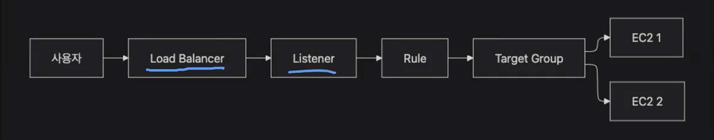
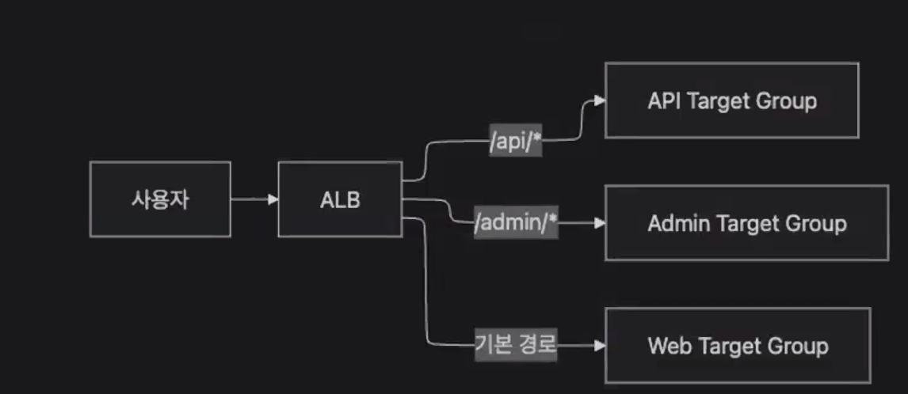

# TIL Template

# 날짜: 2026-06-24

## 스크럼
- 학습 목표 1 : 아침 스크럼에 내가 작성한 표의 URL만 작성
- 학습 목표 2
- 학습 목표 3

## 새로 배운 내용
### ElastiCahce
- 인메모리 캐시 서버를 직접 EC2에 설치하지 않아도 AWS에 제공하는 관리형 캐시 서비스

RDS + ElastiCache를 같이 사용함.

#### 캐시 사용 패턴
1. Cache-Aside 
- Cache를 먼저 보고 없으면 DB에서 조회 후 캐시에 저장하는 방식

Cache Hit: 캐시에 요청한 데이터가 있는 경우
Cache miss: 캐시에 요청한 데이터가 없는 경우

- TTL을 설정해서 캐시에 데이터가 오래 남아 있는 것을 막음.

- 자주 바뀌는 데이터는 짧은 TTL
- 거의 바뀌지 않는 데이터는 긴 TTL
- 최신 값이 필요한 데이터는 TTL만 사용하지 말고 캐시 삭제 및 갱신 로직이 필요함. (캐시 무효화 전략)
- 캐시 무효화 전략: 원본 데이터가 변경되었을 때, 기존 캐시 값을 삭제하거나 수정하는 작업.

#### ElastiCache에서 사용할 수 있는 엔진
- Redis, ValueKey, Memcached
- Redis OSS: 다양한 자료구조와 기능 제공
- Valkey: Redis OSS 호환 계열의 인메모리 저장소, 단순히 K,V마 지원하는 캐시
- Memcached: 단순하고 가벼운 분산 키-값 캐시

- Redis가 다양한 자료구조를 제공하기에 많이 사용됨. (캐시가 단순히 key,value형태로만으로 해결되지는 않음.)

#### 고가용성 구성
1. Replica 구성
2. Multi AZ
3. Shard 
-> 뒤지게 비싸서 가능한 개인프로젝트에서는 가능한 하지 말아야 할 듯.

#### 주의점
1. 캐시는 원본 데이터가 아님.
- 전기가 끊기면 데이터가 나라감.
- TTL이 만료되거나 장애로 제거될 수 있음.
- 캐시만 조회하는 로직을 작성하면 절대 안된다.
- 캐시 히트가 안됐을 때 finally에 DB를 조회하는 로직을 꼭 추가해야함.

2. 캐시 스탬피드
- 예시) 게시글을 매일 자정에 인기글로 10000개가 지정된다면, 동일한 TTL로 지정됨.
- 1초에 10000개가 miss되면 RDBMS로 동시에 많은 요청이 발생함. -> 안정성이 떨어짐.

3. 메모리 부족 현상
- Eviction 정책 : 캐시 메모리가 부족한 경우, 오래되었거나 잘 사용이 되지 않는 키를 제거하는 정책.

### ELB
- Elastic Load Balancer:AWS 관리형 로드 밸러서 서비스.
- 사용자의 요청을 여러 서버에 나누어 전달하고 장애 난 서버를 자동으로 제외해서 서비스가 느려지거나 멈추는 일을 줄여줌. 

- health check: 아래와 같은 경로로 주기적으로 요청을 해서 LB에서 서버가 살아있는 지를 확인함.

``` 
GET /actuator/health
```

#### ELB 구조



1. Load Balancer
- 사용자가 접속하는 입구
- Route53 도메인 등록

2. Listener
- ELB가 특정 포트에서 요청을 기다리는 입구

- 사용자는 요청을 HTTPS로 안전하게하고 
- 서버 내부에서는 안전하니까 HTTP로 요청을 하도록 함.

3. Rule
- 이 요청을 어디로 보낼거냐는 규칙

- url을 활용하여 필요한 요청을 처리하는 서버로 로드 밸런싱을 함.

4. Target Group
- 타겟 그룹은 실제 요청을 처리할 서버들의 묶음.
- 대상 유형, 프로토콜, 포트, Health Check 경로, 성공코드, 등록 대상

#### ELB 종류
1. ALB
- HTTP,HTTPS 
- 웹 서비스 , Spring Boot API
- L7 레이어 (응용 계층 레이어)
- 경로를 보고 요청을 분기할 수 있음.

2. NLB 
- TCP, TLS, UDP, QUIC - 게임서버, TCP 서비스, 초저지연 서비스

#### 구성 방법
1. 보안 그룹 구성
- ELB를 구성할 때 애플리케이션 서버를 인터넷에 노풀하지 않음.

ALB 보안 그룹 
- Inbound: 80,433 / 사용자 
- outBound: 8080

애플리케이션 보안 그룹
- Inboud: 8080,22/ ALB 보안 그룹, 관리자 고정 IP
- Outbound: 3306/ 연결한 DB 보안 그룹

2. HTTPS 처리
- 애플리케이션 서버에서는 하지 않음.
- ALB에서 처리해야함. 그래서 ACM을 통해서 인증서를 발급받아 넣어야함.

##### 장점
1. 인증서 중앙관리
2. 서버 확장 편리
3. 자동 갱신 활용
4. 애플리케이션 단순화

#### 개인적인 생각
- Lisener + Rule + Target Group = ALB라고 생각됨.
- 입력단 + 들어온 요청을 알맞게 처리하기 위한 규칙 + 출력단 -> 이런 느낌인듯.

### CloudFront 
- AWS에서 제공하는 CDN
- 엣지 로케이션: AWS의 분산 네트워크 거점, 콘텐츠를 캐싱하고 사용자에게 전달하는 위치

##### Cache Behavior
- URL 경로별 Origin 캐시 규칙

## 오늘의 도전 과제와 해결 방법
- https://app.notion.com/p/adapterz/389394a4806180e7b30cd970ede0d03d
- 미니퀘스트 0번 진행
- 알게된 사실: 내가 health check를 하기위해 api를 제작하지 않았으면 기본 url '/'로 설정해야 health check가 가능함.


### 오늘의 회고
- 오늘의 학습 경험에 대한 자유로운 생각이나 느낀 점을 기록합니다.
- 성공적인 점, 개선해야 할 점, 새롭게 시도하고 싶은 방법 등을 포함할 수 있습니다.

### 참고 자료 및 링크
- [링크 제목](URL)
- [링크 제목](URL)