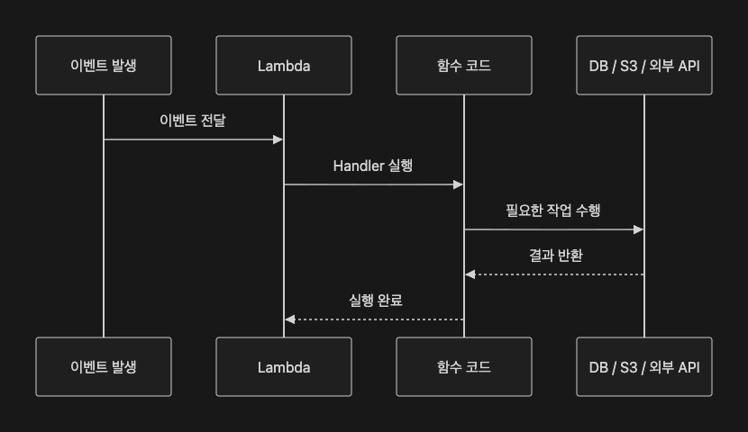

# TIL Template

# 날짜: 2026-06-25

## 스크럼
https://app.notion.com/p/adapterz/389394a4806180a1bf05effb6078825e

## 새로 배운 내용
### Lamda
- 서버를 직접 관리하지 않고 코드만 실행할 수 있는 서버리스 컴퓨팅 서비스
- 지정한 이벤트가 발생했을 때, 이때만 람다가 실행이됨. 그 후 일정시간이 지나면 사라짐

장점
- 실행한 시간만큼 과금
- 확장성이 좋음.

#### Lamda의 실행 방식

1. 이벤트 발생
2. 람다가 실행 환경을 준비함
3. Init 단계
    - 함수 코드 + Lambda layer 다운로드
    - Runtime 초기화
    - 핸들러 밖에 작성한 코드들도 초기화
4. Invoke 단계
    - Handler를 호출함.

#### 사용처
1. 파일 업로드 처리
2. 극초기 API
    - 사용하는 유저가 없고 나는 테스트하고 싶을때 사용할만 한듯.
3. 예약 작업(배치작업)
    - 규칙적으로 어느시간에 해야하는 작업이 있으면 효율적임
    - 예: 매주 새벽에 임시 데이터를 삭제해야함.
4. 비동기 작업처리

#### 람다 설정
1. 메모리
2. 타임아웃

##### 잘 사용하는 법
1. 함수 하나에 하나의 원칙만 둬야함.
2. Cold Start 문제 대응
    - 애초에 실행환경이 무거운 코드는 사용하지 않기
    - 프로비저닝: 람다 실행환경을 미리 준비해두는 것
    - 헬스체크
3. 동시성 문제 해결
- 람다는 limit까지 자동확장 하기에 많은 요청이 몰리면 동시성에 문제가 발생함.
- 예) 1000개의 DB요청이 왔는데 람다가 RDS에 1000요청을 보내버림 -> DB 터짐
- 해결: 중간에 큐를 만들어두어 일정량이상 요청이 오면 큐를 사용하도록 함.

4. 장기간 연결해야하는 요청은 피해야함.
5. 람다를 모든 백엔드 기능의 서버로 두면 안된다.

### API Gateway
- API Gateway는 클라이언트의 API 요청을 받아 백엔드로 전달하고, 인증,권한,모니터링 같은 공통 기능을 API 앞단에서 관리함.

1. MSA
2. 인증 인가를 분리할 때
- API Gateway에서 인증 인가를 담당할 수 있음.
3. 요청 수 제한 API Key 컨트롤
- 외부에 우리 API를 제공하는 것을 제어함
- 무료사용자 초당 몇번 , 유료사용자 초당 몇번 이런것들.

4. CORS 중앙관리
- 분리된 프로젝트 모두 CORS기능이 중복된다면 API Gateway에서 관리할 수 있음

5. API Gateway -> Lambda 같은 AWS 서비스를 직접 호출 할 수 있음

#### API Gateway vs ELB
- 둘 다 요청을 받아 백엔드에 전달
- API Gateway: API를 관리해주는 것이 주 목적임.
- ELB: 여러 서버에 트래픽을 분산 시키는 것이 목적임.

### CloudTrail
- AWS 계정에서 발생하는 모든 API 호출과 콘솔 활동을 자동으로 기록하고 추적하는 서비스
- 감사 및 추적 도구
- 프로젝트 협력할 때 범인 검거하기에 적합한 도구인 듯.

### CloudWatch
- AWS 리소스와 Application에서 발생하는 로그,지표 등을 수집 및 모니터링하는 통합 관제 서비스임.

#### CloudTrail과 CloudWatch 차이
- CloudTrail은 AWS 계정을 모니터링하는 것 -> 누가 어떠한 조작을 했는가
- CloudWatch는 AWS 시스템을 모니터링하는 것 -> 어디가 어떠한 조작을 했는가

#### 필요한 이유
- EC2 CPU가 갑자기 높아짐
- 디스크가 가득 참
- ALB의 5xx 오류가 증가함
- 이것들은 보통 배포 이후 사용자가 사용해서 문제가 발생하고 사용자의 리포트를 통해서 개발자가 문제를 확인함.
- CloudWatch로 이러한 문제를 먼저 감지하려고 한다.

#### DevOps 모니터링이 중요한 이유
- 데브옵스는 배포 자동화니까 필요없다고 생각할 수 있는데.
- 배포 후에도 서비스가 정상적인지 계속 확인해야함. 

1. Metrics
- 시간에 따라 변화하는 숫자 데이터
- EC2 CPU 사용률 같은거
- CPU 사용률이 높아지면, 서버 트래픽이 많아졌다. or 애플리케이션이 비효율적으로 짜져 있다. -> N+1 , FullTable Search, Paging Application.

2. Logs
- 로그는 발생한 문제에 대한 원인들을 기록하게 된다.

3. Alrams
- 특정 조건이 일정 시간 유지될 때, 운영자에게 알림을 보내는 기능

### 옵저빌리티
- 시스템 내부를 직접 열어보지 않아도, 시스템이 밖으로 남기는 메트릭,로그,트레이스를 통해 문제에 대한 원인을 추론할 수 있는 능력
- 서비스가 커지면 SSH 접속으로 해결하기 힘들다.

#### 모니터링과 옵저빌리티 차이
- 모니터링은 이미 예상한 문제를 감지하고 확인하는 것임 
- 그래서 알람 설정할 때 기준을 정해서 그 수치를 넘으면 발송되도록 함.

- 옵저빌리티는 예상하지 못함 문제도 데이터로 원인을 추론할 수 있음.
- 사용자가 로그인이 가끔 실패한다고 하면 개발자는 버그 재현하기 힘듬.
- 옵저빌리티를 보면 외부 API 호출만 간헐적으로 timeout이 발생한다는 것을 확인할 수 있음.

1. Metrics
2. Logs
3. Traces: 요청에 대한 경로를 추적함. 

#### 실무에서 옵저빌리티 높이는 법
1. 로그를 구조화해야함.
* 코드 참조

2. 핵심 API 응답 시간, 오류율 수집
- 모든 API를 수집할 필요는 없지만 중요한 기능은 필요함.

##### 클라우드 와치와 옵저빌리티
- 클라우드 와치는 그냥 데이터를 나열할 뿐 이것을 보고 개발자가 문제를 파악하기는 힘듬.
- 이를 정재해서 개발자가 문제를 쉽게 인지 할 수 있도록 만드는 것이 옵저빌리티임.

### CSR, SSR, SSG

#### Client Side Rendering (CSR)
- 브라우저가 html과 자바스크립트를 서버로부터 받으면 화면을 그림.
- 관리자 페이지, 사내 도구, 로그인 이후에 사용하는 서비스들에서 사용함.

#### Server Side Rendering (SSR)
- 서버에서 렌더링한 HTML 파일을 전달함
- CSR이면 구글 검색 봇이 접속해서 분석하기가 어려움. 하지만 SSR은 HTML를 직접 전달하기에 검색 봇이 데이터를 파악할 수 있음.
- 조회수가 중요한 사이트는 SSR하는 것이 유리함.
    - 하지만 요즘은 CSR도 검색 봇이 알아낼 수 있다고함. 하지만 설정을 좀 건들여야한다고 함. (이건 공부해야할 듯 어렵네...)

#### Static Site Generator (SSG)
- HTML 파일을 미리 빌드해놓고 가지고 있음
- 요청이 오면 만들어둔 HTML을 전달하는 방식임.
- 회사 소개 페이지, 문서 페이지와 같은 간단한 페이지에 적용함.

## 오늘의 회고
- 오늘은 Lambda , API Gateway와 AWS를 완성하고 필요한 정보들을 학습했다. (CloudTrail, CloudWatch)
- Lambda는 이미지를 로드하는 API를 적용하기에 좋아보이는데 아직 그렇게까지 깊게 분리하기는 힘들것 같아서 나중에 최적화 할 때 고려할 듯 하다.
- API Gateway는 비용이 많이 든다고하여서 지금은 적용하지 않을듯하다. 나중에 서비스가 100만 MAU가 나오는거 아니면 사용하지 않을 듯하다.
- CLoudTrail, CloudWathc같은 것은 옵티마이저하는데 필요하여 적용해야하긴 할 것 같다. 개인프로젝트이기에 CloudTrail은 필요없지만 CloudWatch는 적용하는 것을 고려해야할 것 같다.
- 추가적으로 CSR, SSR을 배워서 S3를 좀 더 활용해야할지 고민이다. 이것은 좀 더 공부해봐야겠다.

### 참고 자료 및 링크
- [링크 제목](URL)
- [링크 제목](URL)