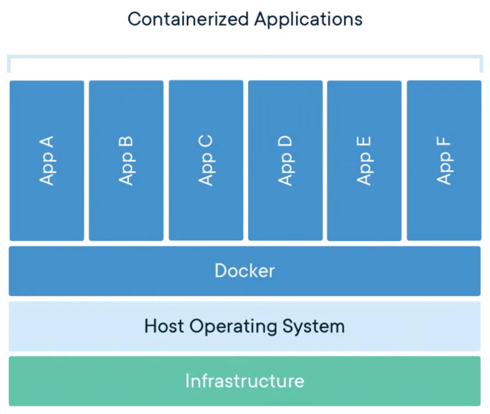
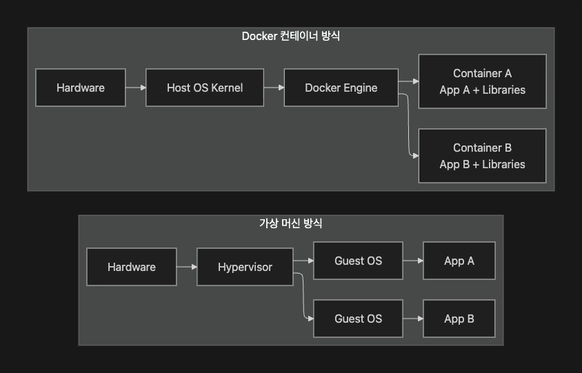
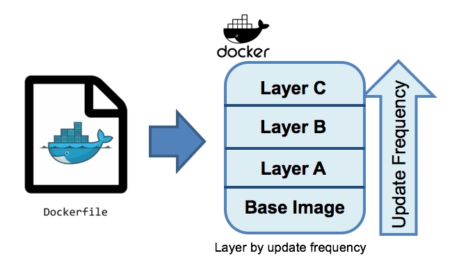
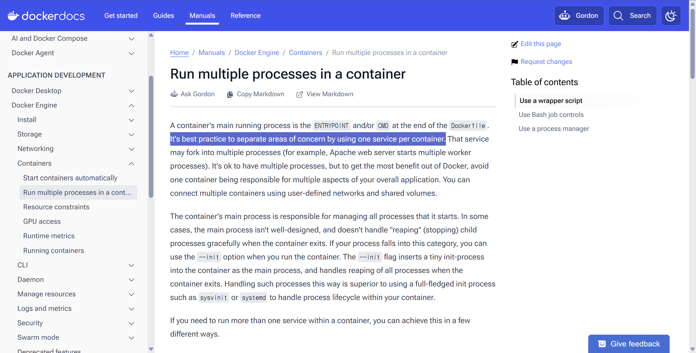

# TIL Template

# 날짜: 2026-06-29

## 새로 배운 내용
### DevOps
- Development + Operation
- 개발과 운영의 협업을 통해 소프트웨어 배포 속도와 안정성을 높이는 문화 및 방법론

#### 사용 이유
- 기존 방식은 개발 및 운영이 분리되어있음.
- 개발 팀은 기능을 빠르게 만들어 빨리 배포하는 것이 필요
- 운영 팀은 서비스를 장애 위험이 있으니, 배포를 최대한 적고 안전하게 하는 것이 필요
- 운영 팀은 배포 일정에 맞추어 배포하기에, 개발 팀이 배포 일정에 개발 완료한 코드를 던짐. -> 배포 덩어리가 커서 안정화가 힘듬.
- 수동 작업
    - 개발 팀은 운영서버에 접속하지 못하게 되어 있음.
    - 운영 팀에서 서버 접속,파일 복사,명령어,설정 수정, 배포 실행
- 개발 서버와 운영 서버의 환경차이 
- 책임 차이

### DevSecOps
- Development + Security + Operation

#### 보안 영역
- 보안 점검 자동화: CI/CD 파이프라인 내 정적 코드 분석(SAST), 동적 애플리케이션 테스트(DAST) 등 자동화된 보안 점검 수행
- 취약점 및 의존성 관리
- 보안 모니터링 및 대응
- 보안 컴플라이언스 관리

#### DevOps 차이
- DevOps는 개발 및 운영 완료 후 별도로 진행
- DevSecOps는 개발 단계부터 운영까지 지속적으로 수행함.

##### 개발 단계	
소스 코드 수준의 보안 취약점 점검 및 의존성 관리	
- 정적 코드 분석(SAST)
- 의존성 점검(Dependency Check)

##### 테스트 및 빌드 단계	
실행 환경에서 보안 취약점 점검	
- 동적 애플리케이션 테스트(DAST)
- 취약점 스캔

##### 배포 단계	
보안 설정 검증 및 정책 준수 확인	
- 보안 컴플라이언스(Compliance)

##### 운영 단계	
보안 문제의 실시간 대응 및 관리	
- 모니터링 및 로깅
- 보안 이슈의 즉각적 피드백 및 수정

### Docker
- Docker는 애플리케이션이 실행되는 데 필요한 코드, 라이브러리, 설정 등을 하나로 묶어, 어떤 컴퓨터에서든 동일하게 실행되도록 도와주는 도구


#### 사용 이유
- 코드는 깃으로 공유를 했었지만, 실행 환경이 달라서 코드 실행을 시키기 위해서 수동으로 환경을 변경해야 했음.
- 자바 버전, 라이브러리 버전, 운영체제 패키지, 환경 변수 등등

##### 기존 해결 방식 - 가상머신
- 하이퍼바이저: 서비스마다 독립적인 OS를 제공하는 방식

장점
- 운영체제를 독립적으로 제공하여 서비스별로 강하게 분리할 수 있음.
- VM 장애가 다른 VM에 전파가 잘 되지 않음.

단점
- 하나의 애플리케이션을 실행하기 위해서 항상 전체 OS를 실행해야함.
- 서비스가 많아지면 자원 사용량, 관리 비용이 커짐.

#### VM vs Docker


- 애플리케이션 프로세스로 격리하기에 상대적으로 가벼움.
- 호스트 linux 커널을 공유함.
- vm은 서버 단위로 격리하고 Docker는 애플리케이션 단위로 배포 및 실행함.

#### 구성요소 (사용자)
- 토커는 실행 환경을 이미지로 표준화하고 컨테이너로 실행하고 레지스트리로 배포함.
- DockerFile
    - 실행 환경 설명서
    - 도커파일에서는 애플리케이션을 실행하기 위해 필요한 작업을 코드로 작성한 파일

- Docker Image
    - 이미지는 애플리케이션을 실행할 수 있도록 준비된 결과물이다.
    - 실행 환경까지 포함된 배포 패키지임.
    - 도커 파일로 도커 이미지라는 결과물을 만들음.

- Docker container
    - 이미지를 실제로 실행한 상태
    - 컨테이너는 별도의 컴퓨터가 아니라 하나의 컴퓨터에서 보이는 환경과 사용 가능한 자원을 제한한 프로세스임.

#### 구성요소 (Docker container)
- 커널: 실제 HW 자원을 관리하는 역할
    - 도커 컨테이너에는 커널이 없음.
    - 호스트 OS 커널을 공유해서 사용함.

- Namespace: 컨테이너마다 독립적으로 존재하는 것처럼 보이게 만드는 Linux의 커널 기능
    - 분리 레벨: 프로세스, 네트워크, 파일시스템
    - PID Namespace
        - 프로세스 목록을 분리
    - Network Namespace
        - 독립적인 IP, port, routing table 분리
    - Mount Namespace
        - 파일시스템을 분리하는 것        

- cgroups: 여러 프로세스를 하나의 그룹으로 묶고, CPU,메모리 등의 사용량을 제한하고 측정하는 Linux 커널 기능
    - Namespace로 인해서 같은 자원을 사용하기에 프로세스끼리 자원싸움을 하게됨.
    - 이를 방지하기 위한 것.

#### 실무에서 도커 활용
- 애플리케이션 -> 도커 파일 -> 이미지 
- 이미지를 Registry 저장하여, 서버에서 레지스트리에 이미지를 다운받아 컨테이너로 띄워서 사용함.

1. 로컬 개발 환경 통일
2. 초기 프로젝트에서 단일 EC2 서버에서 사용
3. 배포 과정에서 컨테이너 사용
* 이미지 첨부
4. 컨테이너르 여러 개 사용할 때, Docker Compose

##### 도커 주의사항
1. image에는 비밀번호를 넣지 않아야함.
- Docker Image는 암호화하지 않고 평문이기에 열면 볼 수 있음.
- Registry에 보안이 잘 안되어있으면, Docker Image를 얻을 수 있음.
- 비밀번호, API key, .env 파일
    - AWS Secret Manager: 비밀번호는 Secret Manager에 직접 넣고 변수로 사용

2. 태그 중에 latest 만 사용하지 않아야함.
- 일반적으로 배포할 때, 최신 버전만 가지고와서 배포하는 경우가 많음.
- 어떤 버전을 사용하는지 디버깅 할 때 모름.
- 그래서 운영 배포 할 때는 버전 명시하는 것이 필요함.

3. 컨테이너 안에 데이터를 영구 저장하지 않아야함.
- 컨테이너는 데이터의 영속성을 보장하지 않음. (종료하면 사라짐)
- Docker + Docker Volume으로 사용해야함. 

4. 하나의 컨테이너에 하나의 핵심 역할만 배치
- 배포 할 때, 확장,장애를 분석하기 어려워짐.

5. 운영 환경에서 로그를 컨테이너 밖에서도 볼 수 있도록 해야함.
- 프로세스에서 발생한 로그를 볼려면 컨테이너에 접속해야함 볼 수 있기에 옵저빌리티가 떨어짐.
- 운영 로그를 컨테이너 내부 파일이 아니라 CloudWatch, Loki, Datado와 같이 외부로 로그를 모아주는 것을 설정하는 것이 좋음.

#### DockerFile
- 도커 이미지를 생성하기 위한 명령어 및 설정이 담긴 텍스트 기반의 스크립트 파일

- 도커 파일은 프로젝트 최상위 경로에 두는 것이 일반적임.

##### 핵심명령어
1. FROM 
- 이 이미지는 어디에서 시작할거냐를 의미
- 도커 이미지는 누군가 만들어둔 이미지에서 시작함.
- 멀티 스테이지 빌드
    - 이미지를 빌드용 코드, 실행용 코드로 분리해서 사용하는 것
    - 빌드하는 이미지는 FROM JDK
    - 실행하는 이미지는 FROM JRE
    - 경량화를 하기 위해서 분리함.

2. WORKDIR
- 컨테이너 안에 작업 폴더는 어디임
``` 
FROM jre21
WORKDIR /app

// 이후 명령어는 기본적으로 /app 폴더를 기준으로 실행함.
```

3. COPY
- 내 프로젝트 파일을 이미지 안으로 넣음.
``` 
COPY /build/libs/my-app.jar app.jar
```

4. RUN
- 이미지를 만들때 사용하는 작업 명령어
```
RUN chmod +x gradlew
RUN ./gradlwe bootJar --no-demon
```

5. EXPOSE
- 이 앱이 사용하는 포트를 표시
``` 
EXPOST 8080
```
- EXPOSE 8080은 호스트의 8080포트를 열어주지 않음. (host port와 container port는 다름)

6. CMD + ENTRYPOINT
- 컨테이너가 시작되면 뭘 실행할까?

```
ENTRYPOINT ["java","-jar", "app.jar"] // 컨테이너가 시작되면 실행한다.
CMD ~~ // 이후에 이런 명령도 실행한다.
```
- ENTRYPOINT: 주 실행 명령 / 항상 실행해야하는 프로그램 명령어
- CMD: 기본 플래그, 기본 인자 / 기본 값인데, 실행시 바꿀 수 있는 옵션

#### Docker file 과 image layer

- 도커 이미지는 레이어 구성임.
    - 도커는 이전 빌드에서 변경되지 않은 내용은 재사용함.
- Dockerfile의 각 명령어는 순차적으로 실행됨.
- Base Image를 기반으로 위쪽으로 레이어가 쌓이면서, 자주 변경될수록 위쪽 레이어로 배치해 빌드 과정에서 캐싱효과를 극대화하는 구조
- 이러한 구조로 인해서 최적화를 위해서 순서를 잘 설정해야함.

#### Docker Image
- 애플리케이션 실행에 필요한 파일을 여러 개의 읽기 전용 레이어로 쌓아 만든 실행 환경의 스냅샷임.

##### Layer
- 레이어는 전체 파일시스템 복사본이 아니라, 이전 레이어와 비교해 추가,수정,삭제된 파일의 차이를 저장하는 단위임.
- overlayfs로 하나의 fileSystem으로 합침.
* overlayfs: 여러 개의 Image Layer를 겹쳐, 하나의 완성된 파일 시스템처럼 사용할 수 있도록 하는 Linux 파일시스템 기능 (의문: 처럼이면 정작 하나의 파일 시스템은 아니라는 건가?)

#### Docker Container
- Docker Image를 바탕으로 실제 애플리케이션 프로세스를 실행한 격리된 실행단위임.

##### 사용 이유
- 컨테이너는 실행환경에 맞게 이름,포트,환경변수를 적용해서 실제 서비스를 실행하기 위해서 필요함.
- 컨테이너는 메인 프로세스가 끝나면 중지됨. 그래서 "-d"로 끝나지 않게 할 수 있음.

##### 주의 사항
1. 도커는 종료되어도 바로 지워지지 않음. (컨테이너 + 볼륨 + 이미지) 
- 그래서 도커를 종료하고 도커 이미지들을 삭제해야함. (안그러면 이미지들이 하드디스크 자원을 차지함.)

2. 컨테이너는 이름을 붙여야함.
``` text
docker stop fdf3059133f5
docekr stop was-spring
// 이거 금지

docker create & start = run
// 만들고나서, 확인하고 스타트를 하는 것이 안전함.
```
3. Docker run 반복해서 쓰지 않기
- docker run은 기존 컨테이너를 찾아서 실행하는 명령어가 아니라 매번 새로운 컨테이너를 생성하기에 

4. 운영 컨테이너는 직접 수정 x
- 수정해도 값이 유지가 되지 않기에 이미지를 수정해야지 컨테이너를 수정하지 말아야함.

5. 컨테이너는 실행 중이라 해서, 정상 상태가 아님.
6. 운영 재시작 정책 고려
- 서버는 항상 재부팅이 될 수 있음.
- 자동 재실행이 가능한데, 이 때 어떻게 컨테이너가 수행해야하는지 미리 기재하는 것이 좋음.

### Registry
- 컨테이너 이미지를 저장하고 배포하기 위한 중앙 저장소
- github가 git의 hub인 것처럼, Docker의 Hub같은 곳
- Registry 서비스로는 Docker Hub , Amazon ECR이 있음.(public , private으로 사용함.)

### 한 줄 정리
 - Devops: 개발과 운영이 협업하기 위한 방법, 서로간의 이해차이를 극복하기 위해서.
 - Docker: Dockerfile + image + container로 구성된 배포 서비스, 배포할 때마다 바뀌는 환경때문에 결과가 달라지는 상황을 막기 위해 사용함.
 - Namespace: 컨테이너를 구현하는 기술, 각 컨테이너를 격리하기 위해서
 - Cgroups: 여러개의 프로세스를 하나로 묶는 기술, 격리된 컨테이너들의 자원경쟁을 방지하기 위해 사용함.
 - Dockerfile: 명령어 및 코드 덩어리 , 이미지를 만들기 위해서 사용함.
 - Image: 여러개의 읽기 레이어로 쌓여진 실행 환경 묶음 , 사용자가 배포를 위해 환경설정을 따로 할 필요없게 하기 위해서 사용함.
 - Overlayfs: 여러 개의 레이어를 하나의 파일 시스템으로 합치는 기능. 사용자가 image사용을 편하게 하기 위해서?
 - Container: image를 실행하여 형성된 격리된 프로세스 단위, 프로세스 단위로 격리하기 위해서
 - Registry: Docker의 Hub, image들을 보관했다가 나중에 사용하기 위해서

 ### 추가적인 고민
 
 - Docker에서는 container 하나에 프로세스 하나를 권정함. 
 - 그럼 이를 지킨다는 가정하에 PID namespace를 잘 사용하지 않을 것 같음.


### 오늘의 회고
- 오늘은 처음으로 오프라인 교육을 진행하여 어색하지만 신기하고 좀 더 열심히하게 된 것 같다.
- Docker를 알고는 있었지만 이렇게 깊게 공부한 적은 없어서 어색했다. 또한 팀원의 질문인 container를 ec2에서 사용하면 논리적으로 두 번 나누는 것이니까 불필요하지 않는가?? 라는 의견을 들었다. 상당히 공감되는 질문이였다. 