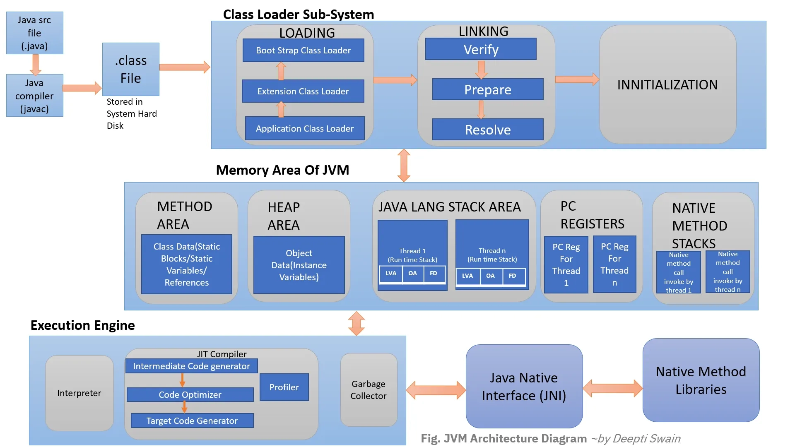

# TIL Template

## 날짜: 2026-05-13

### 스크럼
- 학습 목표 1 : 아침 스크럼에 내가 작성한 표의 URL만 작성
- 학습 목표 2
- 학습 목표 3

### 새로 배운 내용
#### computer의 어원
- compute + er로 원래는 탄도 궤적이나 로켓의 궤적 등 계산을 하는 사람(주로 여성)을 지칭했음.
- 과학의 발달로 전산기계가 그 자리를 대체하면서 이름을 물려받음.

#### 자바: 자바가 가진 장점과 이유
- 자바는 c언어의 문제를 해결하기 위해서 만들어짐
- c언어의 특징
    - 장점
        1. 메모리를 직접 관리함으로써 잘 사용하면 높은 성능을 보인다.
        2. 절차 지향 언어라 코드가 늘어나면 유지보수가 힘들어진다.

    - 단점
        1. 메모리를 직접 관리함으로써 못 사용하면 낮은 성능을 보인다. (메모리 누수)
        2. 절차 지향 언어라 프로그램의 흐름이 명확하다.

- 자바의 특징 
    1. JVM을 활용 (플랫폼 독립성, 메모리 자동관리 , 보안성)
    
    출처: [Medium](https://interviewnoodle.com/jvm-architecture-71fd37e7826e) ([by Deepti Swain](https://deeptiswain.medium.com/))
    
        1) JVM을 사용해서 CPU가 바뀌어도 다시 컴파일 할 필요가 없다.
            * program.c -> 컴파일 - > 기계어 파일 (.exe)
            * program.java -> 컴파일 -> 바이트코드(.class) -> JVM -> 기계어로 변환하여 실행

            - 이러한 과정으로 인해 c언어는 cpu와 운영체제만 맞다면 바로 실행가능하지만 java는 java를 설치 해야지만 실행이 가능한 특징이 있는듯 (그래서 마크할때 자바를 번거롭게 설치 할 필요가 있는거구나?)

        2) JVM이 메모리를 자동관리해준다. (GC)
        3) JVM을 거쳐서 메모리를 다루기에 직접 다루는 C언어보다 안정성과 보안성이 좋다.

    2. 객체 지향 언어라 유지.보수가 용이하다. (객체지향)
        1) 중복되는 코드를 객체화 해서 코드 재사용을 할 수 있다.
        2) 캡슐화, 상속 등을 할 수 있다.

### 오늘의 도전 과제와 해결 방법
- 도전 과제 1: 한줄 정리
    - 컴퓨터언어 => 계산하는 기계와 대화하기 위한 언어.
    - 자바 => jvm위에 실행되는 객체지향 언어.
    - JDK=> 자바를 활용해 개발하기 위한 키트.
    - JRE=> 바이트코드를 실행시키기 위한 환경.
    - 바이트코드 => jvm이 기계어로 바꿀수 있도록하는 중간 단계.
    - GC => 힙에서 참조하지 않는 객체의 메모리를 반환하는 역할.
    - 스택 =>  프로그램에서 참조변수나 기본 자료형을 저장하는 공간.
    - 힙 => 프로그램에서 참조되는 객체들을 저장하는 공간.

### 오늘의 회고
- 한줄정리를 팀원과 공유하면 생각을 공유하는것이 좋았다.

### 참고 자료 및 링크
- [링크 제목](URL)
- [링크 제목](URL)
