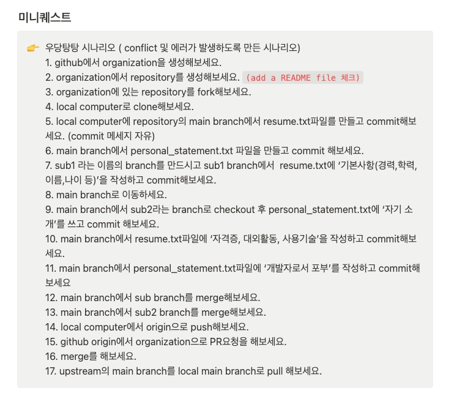

# TIL Template

## 날짜: 2026-05-14

### 스크럼
- 학습 목표 1 
- 학습 목표 2
- 학습 목표 3

### 새로 배운 내용
#### GIT: 주제에 대한 설명
- git의 자주 사용하는 기본 명령어
    - git init : 초기화
    - git remote : 저장소 가져오기
    - git status(가끔 사용했었음.) : 임시 쓰레기통
    - git add : 파일을 stage에 올리기 
    - git commit : 변경내용 확정 및 메모
    - git push : local repository -> remote repository
    - git clone : remote repository -> local repository (처음)
    - git pull : remote repository -> local repository (최신)
    - git log : commit 기록 log 
- git의 자주 사용하는 응용 명령어
    - git rebase : main branch에 다른 branch를 이어 붙힘
        - 장 : log가 단순해져서 관리가 편해짐
        - 단 : 커밋 해쉬를 바뀌어 강제 push가 필요해짐. 
        => 개인의견: 혼자 프로젝트할 때 남발하게 되던데 팀프로젝트때 쓸 생각하지 말자.
    - git restore : commit하지 않은 파일을 마지막으로 commit한 local repository에서 최신상태로 가져옴.
    - git revert : 돌아간다는 기록을 남김 
        - 장 : log를 남기기에 협업자에게 어떠한 이유로 돌아가는지 알려줄 수 있음.
        - 단 : log를 남기기에 남발하면 log가 더러워짐.
        => 개인의견 : 돌아간다는 것을 기록에 남기기에 남발하면 log가 더러워지는것을 경험함. 그러니 여러번 생각하고 사용하자.

#### java : class에 대한 설명
- 개인 질문 : 상속을 하는게 좋아보이는 경우가 여럿 있다. 예를 들면 자동차와 기차가 작동하는 부분에서 공통점이 엑셀과 브레이크 기능이 있다. 그러하면 자동차를 먼저 만들었을때 기차에 자동차를 상속하여 이해관계는 박살났지만 중복된 부분을 줄여 코드가 짧아졌다. 혼자서 하다보면 이러한 경우가 많은데 바람직한 것은 기차와 자동차의 공통된 기능을 부모클래스로 만들어서 각각 상속하는게 이상적인가? 

    - 답 : 부모클래스로 만드는 것이 맞지만 지금은 그럴 필요 없다. 그렇게 복잡하게 하면 보기가 힘드니까 처음은 그냥 따로따로 하고 최적화 할 때 그렇게 해라.

### 오늘의 도전 과제와 해결 방법
- 도전 과제 1: github 프로필 업데이트
- 도전 과제 2: 우당탕탕 시나리오로 PR해보기 git 명령어 응용의 ‘github에서 PR하는 법 (컨트리뷰터)’ 

- 도전 과제 3: til 시작

### 오늘의 회고
- 오랜만에 git을 다시 사용하고 또한 gui로만 사용하던것을 cli를 사용하려니까 머리가 아프다.
- java에 대한 객체지향 특징들을 이미 알고 있었지만 다시 배우니 감회가 새롭다.

### 참고 자료 및 링크
- [링크 제목](URL)
- [링크 제목](URL)