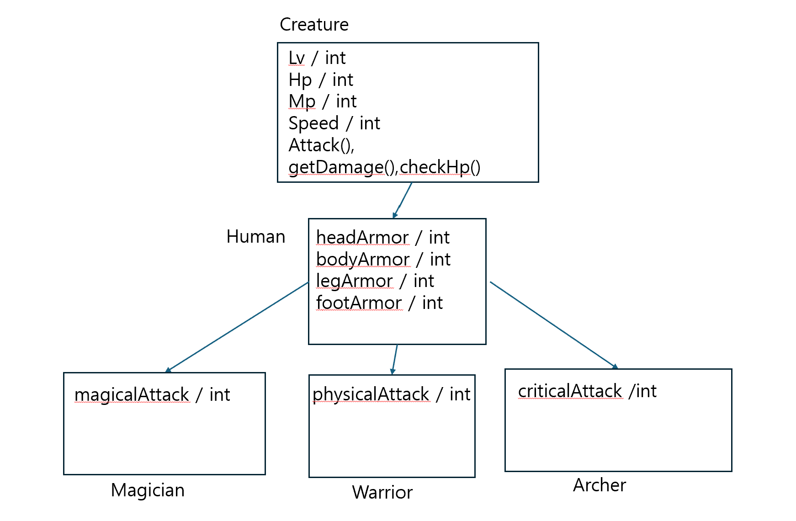
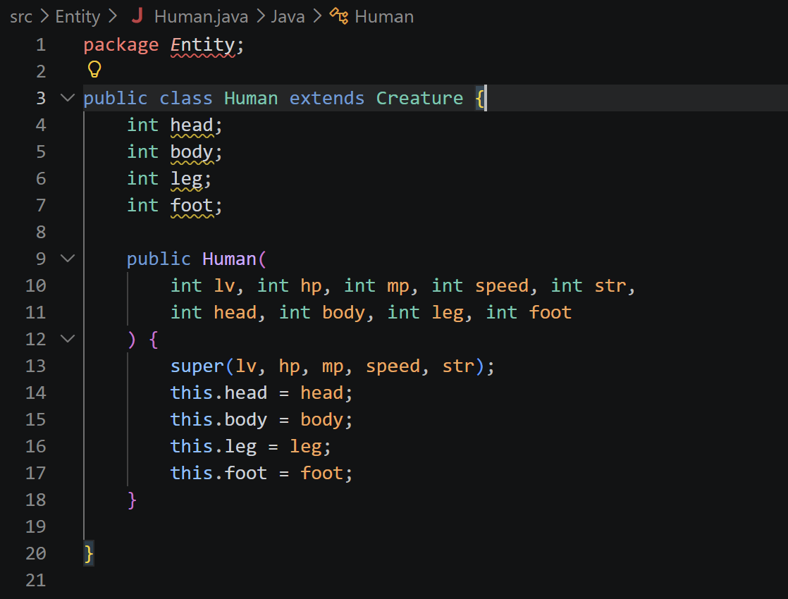

# TIL Template

## 날짜: 2026-05-15

### 1주차 과제 회고
#### 클래스 설계도 작성
- 가장 재밌어보이는 게임 관련으로 작성하고 싶어서 고민하기 시작했다.
- 자연스래 플레이어와 관련있는 인간을 부모로 하는 다양한 직업들을 자식으로 설계하고 조부모를 고민해서 생물체가 적당해보여 creatrue로 지었다.
- 그리고 각 class에 필수적으로 필요한 스탯들과 행동들을 각각 변수와 함수로 지정하였다. 

- 그 후에 바로 코딩을 시작하여 완성하였다. 설계를 한 후에 하여 코딩에 관련된 자잘한 버그 이외에는 문제 없었다.

## 코딩관련 회고

1. package명 문제발생

- 분명 파일을 적절한 위치에 생성하여 .java 파일도 잘 배치하고 package에 명도 잘 입력했는데 빨간줄로 오류라고 떴다.
- 옛날에 이러한 버그를 봤던것 같은데 리부트로 해결했던것 같아서 vsCode를 껏다가 키니까 빨간줄이 사라졌다. (?)

2. switch냐 if else 문이느냐
- 이는 번호를 선택해야 진행되는 cli 게임 특성상 아무래도 switch가 잘 어울린다.
- if문은 범위를 사용하는 조건문에 적합 
- switch는 가독성이 높은 대신 복잡한 조건문엔 적합 x

''' java 
switch (choose) {
                case 1:
                    creature = new Warrior(
                        1, 100, 50, 10, 20, 
                        5, 5, 5, 5
                        , 10);
                    break;
                case 2:
                    creature = new Archer(
                        1, 100, 50, 10, 20, 
                        5, 5, 5, 5
                        , 10);
                    break;
                case 3:
                    creature = new Magician(
                        1, 100, 50, 10, 20, 
                        5, 5, 5, 5
                        , 10);
                    break;
                default:
                    System.out.println("잘못된 선택입니다.");
                    continue;
            } 
'''

3. 라벨을 사용한 break
''' java
OUTER:
            while (creature.checkHp() > 0 && enemy.checkHp() > 0) {
                System.out.println("1. 공격");
                System.out.println("2. 종료");
                System.out.print("선택: ");
                int action = sc.nextInt();
                switch (action) {
                    case 1:
                        int damage = creature.attack();
                        int enemyHp = enemy.getDamage(damage);
                        System.out.println("적에게 " + damage + "의 피해를 입혔습니다. (적 HP: " + enemyHp + ")");
                        if (enemyHp > 0) {
                            int enemyDamage = enemy.attack();
                            int playerHp = creature.getDamage(enemyDamage);
                            System.out.println("적에게 " + enemyDamage + "의 피해를 입었습니다. (내 HP: " + playerHp + ")");
                        }   break;
                    case 2:
                        System.out.println("게임을 종료합니다.");
                        break OUTER;
                    default:
                        System.out.println("잘못된 선택입니다.");
                        continue;
                }
            }
'''
- 라벨을 사용하지 않을 경우 switch문만 break 됨. 
- 그래서 switch 위에있는 반복문을 탈출하기 위해 라벨링을 통해 종료 (break)

#### 게임 흐름

시작 
-> 캐릭터 직업 종류 및 종료 선택 (choose) / (캐릭터 생성시 전투몹 생성)
-> 공격 및 종료 선택 (action) / (해당 전투는 플레이어나 전투몹 둘 중 하나가 죽지 않는 이상 끝나지 않음.)

### 참고 자료 및 링크