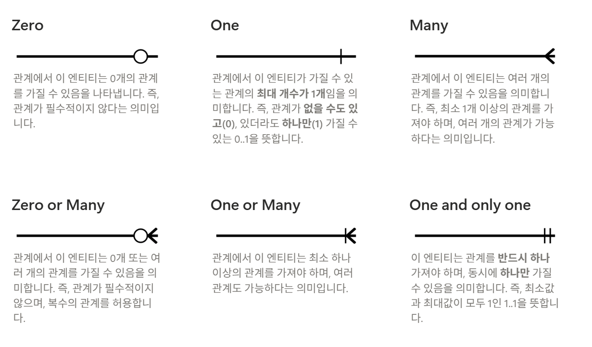
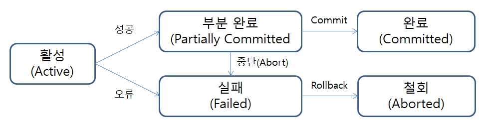

# TIL Template

## 날짜: 2026-05-26

# 데이터베이스 & 인덱스 & 트랜잭션 정리

---

# 천공카드와 CLI 프로그램

- 80 * 24줄의 천공카드 사용
- 그래서 CLI 프로그램은 80줄까지 표기하는 문화가 생김
- Clean Code 또한 80줄 정도를 권장하는 흐름이 존재

## 코더(Coder)

- 천공 카드 값을 입력하는 직업의 이름

---

# 파일 시스템(File System)

- 각 기능별로 하나의 파일을 만들어서 사용

## 단점

1. 데이터 기록이 중복됨
2. 파일이 커지면 찾기가 어려움
3. 보안 및 권한 관리 부족
4. 동시에 읽기는 가능하지만 동시에 수정은 어려움
5. 다른 OS에서 제대로 읽히지 않을 수 있음

---

# 데이터베이스(Database)

- 데이터를 저장하는 곳
- 데이터를 안정적으로 공유하기 위해 사용

## 관계형 데이터베이스(RDB)

- 데이터를 표(Table) 단위로 관리
- 표 간의 관계를 표현
- 객체지향 언어와 비슷한 느낌

## RDBMS

- Relational Database Management System
- 관계형 데이터베이스 관리 시스템

---

# 테이블 설계하기

1. 엔티티(Entity) 정의
2. 속성(Attribute) 정의
3. 관계(Relationship) 정의

## 엔티티(Entity)

- 데이터베이스에 저장하고자 하는 대상

## 속성(Attribute)

- 대상이 가진 정보
- 메타데이터와 비슷한 느낌

## 관계(Relationship)

- 테이블끼리의 연결 관계

---

# SQL

## SQL (Structured Query Language)

- 구조화 질의 언어

## SQL 분류

| 분류 | 설명         | 예시           |
|-----|-------------|----------------|
| DDL | 데이터 정의어 | CREATE         |
| DML | 데이터 조작어 | SELECT, INSERT |
| DCL | 데이터 제어어 | GRANT, REVOKE  |

---

# ERD (Entity Relationship Diagram)

- 개체와 관계를 한눈에 알아볼 수 있도록 만든 도표
- 데이터 구조를 시각적으로 파악하기 위한 목적

## 데이터 모델링
    
1. 정보 모델링
2. 논리적 모델링
3. 물리적 데이터 모델링 (실제 DB 구현)

# Crow's Foot



# 식별 / 비식별 관계

- 실무에서는 비식별 관계를 선호하는 편

---

# Index

- 조회를 빠르게 할 수 있게 하는 기술
- 결국 인덱스는 Key와 Value를 통해 값과 주소값을 매핑하는 기술이라고 생각하면 될 듯

# Hash Index

## 특징

- 입력값에 따라 같은 출력값 생성
- 버킷에 인덱스 값으로 매핑
- 미리 저장된 메모리에 접근하므로 탐색 속도가 가장 빠름

## 장점

1. 단일 검색 속도가 매우 빠름
2. 인덱스 크기 효율성이 좋음
3. Key를 주소로 빠르게 변환 가능

## 단점

1. 순서가 없어 범위 검색 불가능
2. 정렬 및 그룹화 불가능
3. 부분 일치 검색 불가능
4. 해시 충돌 문제 발생 가능
5. 충돌이 많아지면 성능 급격히 저하

## 사용처

1. 캐싱 시스템에서 많이 사용

# Hash Function

- 값을 넣으면 고정된 길이의 주소값으로 변환하는 함수
- 예시 : 32bit 해시값 생성

# Tree Index

## 특징

- 노드 기반의 트리 자료구조
- 부모-자식 관계를 가지는 계층형 구조
- 탐색 속도가 빠름

## 단점

- 우편향 트리 문제가 발생 가능
- 삽입/삭제가 많아질 경우 인덱스 비용 증가

# B-Tree (Balanced Tree)

- 트리의 높이를 균형 있게 유지하는 트리

# B+Tree

- MySQL InnoDB 엔진의 기본 인덱스 자료구조

## 특징

1. 실제 데이터는 리프 노드에만 저장
2. 내부 노드는 탐색 용도로만 사용
3. 리프 노드끼리 연결되어 있음

## 장점

1. 더 많은 키 저장 가능
2. 범위 검색에 유리
3. 순차 접근이 쉬움

---

# B-Tree vs B+Tree

## 차이점

- B-Tree : 노드에 Key + Value 저장
- B+Tree : 리프 노드에만 Value 저장 + 리프 노드끼리 연결되어있어서 linked list 특성일 띔

## 인덱스 구성

- 인덱스 = Key 값 + 디스크 주소값

## 데이터 조회

- DB는 페이지 단위로 데이터를 읽음
- 일반적으로 16KB 단위 사용

---

## B-Tree

- 데이터를 가져올 때 16KB / (노드 크기)만큼 저장 가능
- 같은 데이터를 넣어도 노드 깊이가 깊어질 수 있음

---

## B+Tree

- 데이터를 가져올 때 16KB / (키 크기) 만큼 저장 가능
- 더 많은 Key 저장 가능
- 트리 깊이가 얕아짐
- 검색 속도가 향상됨

---

# Fan-out

- 하나의 노드가 가질 수 있는 최대 자식 노드 개수

## 특징

- B-Tree는 자식 노드 수가 상대적으로 적음
- B+Tree는 Fan-out이 커져 깊이가 줄어듦

---

# B+Tree 범위 검색

- 리프 노드끼리 연결 리스트 형태로 연결됨
- 범위 검색 시 순차 탐색 가능

즉: Tree 구조의 범위 검색 한계를 일부 해결

---

# B-Tree가 유리할 수도 있는 경우

- 데이터가 적은 경우

## 이유

- B-Tree는 상위 노드에도 실제 데이터 저장 가능
- 루트나 중간 노드에서 바로 데이터 접근 가능

반면 B+Tree는:

- 실제 데이터가 리프 노드에만 존재
- 반드시 리프까지 내려가야 함
- 그래서 폴더탐색같은 경우는 B-Tree를 사용함. 

---

# Full Text Index

- 문장을 특정 단위로 분리하여 검색하는 기법
- 문장을 단어 단위로 분리하고 그것을 Key로 사용

# Inverted Index

- 문서를 단어 단위로 분리
- 각 단어가 어느 문서에 존재하는지 저장

## 특징

- 연결 리스트나 트리 구조 활용 가능

# Parser

- 문장을 단어 단위로 분리하는 엔진

# Stopword Parser

## 특징

- 공백, 문장부호 기준으로 분리
- 영어권에서는 잘 동작

## 단점

- 한국어는 조사와 어절 문제로 정확도가 떨어짐

# N-Gram Parser

## 특징

- 지정된 글자 수 단위로 자름

## 장점

- 한국어 검색에 상대적으로 강함
- 조사 여부와 관계없이 검색 가능

## 단점

1. 인덱스 크기가 커짐
2. 오검색 확률 증가

# MeCab

- 형태소 분석기

## 특징

- 한국어 자음/모음/받침 분석 가능

## 장점

1. 한국어 검색 품질 향상
2. 인덱스 경량화 가능

## 단점

1. 동의어 처리 어려움
2. 문맥 분석 한계
3. 대용량 트래픽 처리 부담

---

# 검색 엔진

## 결론

- 한국어 검색 성능을 높이려면 별도 검색 엔진 사용이 좋음
- (그래서 네이버나 토스 등 대기업은 검색에 필요한 정보들을 하나하나 저장해서 만들었다고 했던것 같은데)

## Elastic Search

- 별도 검색 엔진에 데이터를 저장
- 검색은 검색 엔진에서 수행

---

# Full Text Index의 한계

1. 기본적으로 무거움
2. 전문 검색 엔진 수준은 아님

예시: 분당 떡볶이

검색 시:

```text
맛집
```

같은 연관 의미까지 찾기 어려움

---

# Transaction

- 일처리의 최소 단위
- 여러 작업을 하나의 논리적인 작업으로 묶음
- 데이터베이스의 무결성과 일관성을 보장하기 위해 사용

---

# 무결성과 일관성

## 무결성(Integrity)

- 데이터 자체가 이상하지 않은 상태

예시)
- PK 중복 금지
- NULL 금지
- FK 제약 유지

---

## 일관성(Consistency)

- 데이터 사이의 논리가 정상적인 상태

예시)
- 계좌 이체 시 총 금액 유지
- 주문 상태와 재고 상태 일치

---

# Transaction 상태



---

# Partially Committed

1. Commit 명령이 도착한 상태
2. 모든 명령 실행 완료
3. 아직 디스크에 영구 기록 전 상태

---

# Failed

1. 트랜잭션 실패 상태

---

# Aborted

1. 트랜잭션 취소 상태
2. Rollback 수행
3. 이전 상태로 복구

---

# Committed

1. 트랜잭션 성공 상태

---

# ACID

- Atomicity
- Consistency
- Isolation
- Durability

---

## Atomicity

- 모두 성공하거나 모두 실패해야 함

---

## Consistency

- DB의 규칙은 항상 유지되어야 함

## Isolation

- 각각의 트랜잭션은 독립적으로 동작

## Isolation Level

- 트랜잭션 독립 수준 정의

## Durability

- Commit 완료 시 어떠한 상황에서도 데이터 유지

### 추가 의문점

```text
데이터베이스가 물리적으로 손상되어도 유지해야 하나?
```

그래서 백업 DB, WAL, Replication, 이중화 시스템 등을 사용

---

# 최종 한줄 정리

데이터베이스 : 데이터를 안정적으로 공유하기 위해 사용하는 저장소 
ERD : 관계형 데이터베이스 구조를 사람이 쉽게 이해할 수 있도록 만든 도표
Index : 검색을 빠르게 하기 위해 Key와 주소값을 매핑하는 기술
Tree : 부모-자식 관계의 계층 구조
Hash : Hash Function을 통해 Key를 주소처럼 사용하는 구조
Full Text Index : 문장을 단어 단위로 분리하여 검색하는 기술
Transaction : 데이터를 생성/수정할 때 무결성과 일관성을 유지하기 위한 작업 단위

