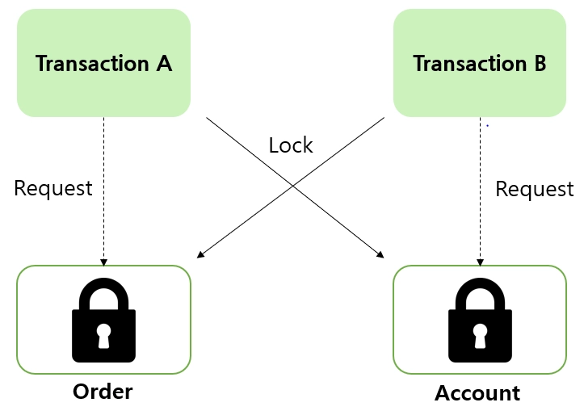
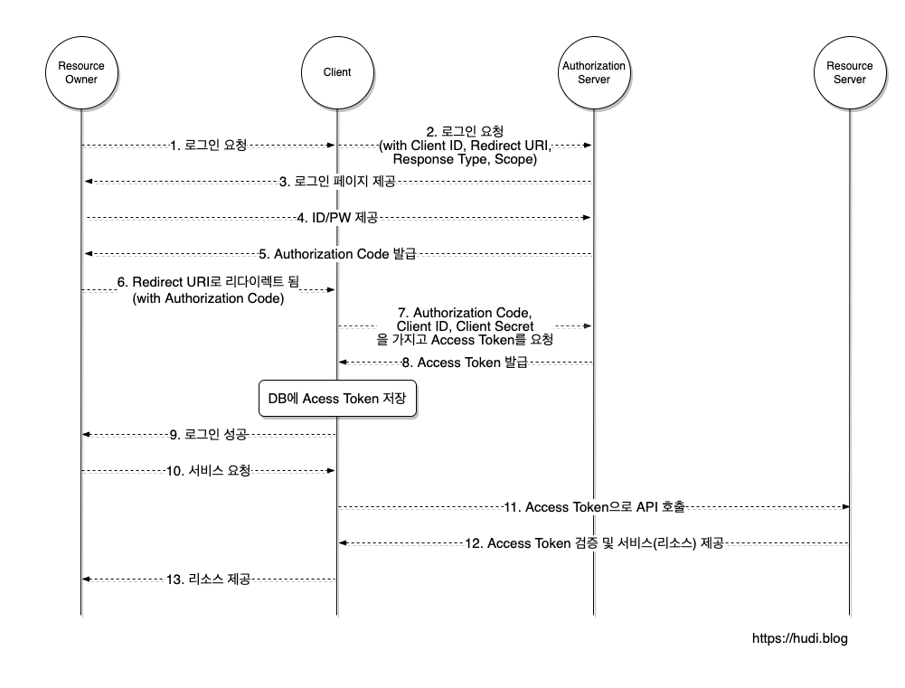

# TIL Template

# 날짜: 2026-05-29

## 스크럼
- 학습 목표 1 : [아침 스크럼에 내가 작성한 표의 URL만 작성](https://app.notion.com/p/adapterz/36e394a48061800b869afdb805b43c3f)

## 새로 배운 내용
### 데이터베이스 동시성 제어
- 여러 사용자가 동시에 데이터베이스에 접근할 때 발생할 수 있는 문제를 방지하고 데이터의 일관성과 무결성을 유지하는 기술

- 트랜잭션1이 진행되는 사이에 트랜잭션2가 발생하여 데이터의 일관성이 박살남. 그래서 동시성 제어가 필요해짐. 

트랜잭션이 겹치지 않으면 = Serial Schedule
트랜잭션이 겹치면 = Non-Serial Schedule

Transaction Conflict
1. 서로 다른 트랜잭션 소속
2. 같은 데이터에 접근
3. Write가 존재

=> 일관성을 보장하기 위해선 순서가 필요해 = 직렬화

#### 비관적 락(Pessimisitic Lock)

- 충돌이 일어날 가능성을 가정함
- 데이터를 사용하기 전에 락을 걸어 다른 사용자의 접근제어
- 일반적으로 RDBMS에서 사용
- 일관성을 유지할 수 있지만 성능이 떨어지고 데드락 발생할 수 있음.

##### Deadlock 


- A와 B가 각각 하나의 락을 가지고 있고 트랜잭션을 수행하려면 교차하는 lock이 풀려야 할 수 있음. 
- 비유하자면 서로 멱살잡고 먼저 놓으라는 꼴 

#### 낙관적 락
- 데이터를 먼저 사용한 뒤, 최종 업데이트 시에 충돌 검사
- NoSQL에서 사용
- 동시성이 높아서 분산 시스템에 적합
- 충돌 발생 시 예외 처리가 복잡함. + 충돌이 지속적으로 발생하면 중첩되어서 처리비용이 증가함.


#### OAuth

1. 예시 : 카카오의 서비스를 우리 서버로 가져와서 사용하고 싶은데 그럴려면 카카오의 인증/인가를 우리 서버에서 수행해야함. -> 우리 서버에서 카카오의 아이디와 비밀번호를 받는다? 우리도 보안에 신경써야해서 싫고 카카오도 보안이 제 3자에 달려서 싫고

- 인증은 유저와 resource server 가 하고 인가는 우리 어플리케이션과 resource server가 함.

2. 실행 흐름


PKCE (Proof Key for Code Exchange)


## 딥다이브

쿠키·세션 기반 인증과 JWT 기반 인증에서 자격증명이 브라우저 ↔ 서버 간에 전달되는 흐름을 단계별로 설명하고, CSRF와 XSS 관점에서 각각 어떤 보안 취약점이 생길 수 있는지 분석하시오.

### 키워드 별 딥다이브

#### 1. HTTP Cookie
    
    
    
    - HTTP Cookie + Session 동작 흐름
        1. Client 로그인
        2. SessionId를 서버가 생성한 후 저장 + SessionId를 쿠키에 담아 응답
        3. 브라우저가 응답을 받아서 브라우저 쿠키에 저장 
        4. 이후 인증이 필요한 요청을 할때마다 쿠키에 SessionId를 담아서 전송함
        5. 서버는 받은 SessionId를 서버 SessionId와 대조하여 신원을 확인함. 
    - 세션관리 , 개인화 , 트래킹을 목적으로 사용
    - 지금은 modern storage APIs를 사용해 정보를 저장하는 것을 권장함. (모든 요청마다 쿠키가 전송되기에 이를 해결하는 방식)
    - Set-Cookie Header
        
        ```html
        Set-Cookie: <cookie-name>=<cookie-value>
        ```
        
        - 이를 클라이언트가 저장하고 요청할 때 넣어서 보냄.
    - 쿠키의 lifetime
        - 세션 쿠키 (`Expires`, `Max-Age` 속성이 없는 쿠키)는 현재 세션이 끝날 때 삭제됩니다. 브라우저는 "현재 세션"이 끝나는 시점을 정의하며, 어떤 브라우저들은 재시작할 때 세션을 복원해 세션 쿠키가 무기한 존재할 수 있도록 합니다.
        - 쿠키 만료 시점을 설정할 때 만료시점은 쿠키가 저장되는 클라이언트 시간을 기준으로 함.
    - Secure , HttpOnly 쿠키
        - Secure 쿠키는 HTTPS의 암호화된 요청일 경우에만 전송함. (그래도 민감한 정보는 절대로 쿠키에 저장하면 안됨. 본질적으로 안전하지 않음)
        - XSS를 막기위해 HttpOnly 쿠키는 JavaScript의 [`Document.cookie`](https://developer.mozilla.org/en-US/docs/Web/API/Document/cookie) API에 접근 불가 (이유 : 서버의 세션 쿠키는 JavaScript)를 사용할 필요가 없어서)
    - 쿠키의 스코프
        - Domain은 쿠키가 전송되게 될 호스트들을 명시함.
        - Path는 쿠키헤더를 전송하기 위해 요청된 URL내에 반드시 존재해야하는 URL 경로
        - SameSite 쿠키 : 쿠키가 cross-site 요청을 막아서 CSRF에 대해 보호방법을 제공함. (아직은 실험중이며 모든 브라우저에 의해 제공되고 있지는 않음)
    - 보안
        - 세션 하이재킹과 XSS
        - Cross-site 요청 위조 (CSRF)
    - 트래킹과 프라이버시
        - 서드파티 쿠키
        - Do-Not-Track
        - EU 쿠키 디렉티브
        - 좀비 쿠키와 Evercookies
#### 2. HTTP JWT
    - 출처 [RFC 7519](https://datatracker.ietf.org/doc/html/rfc7519?utm_source=chatgpt.com) , https://www.ibm.com/docs/en/cics-ts/6.x?topic=cics-json-web-token-jwt
        
        
        
        - jwt의 HTTP 흐름
            1. client가 로그인을 함.
            2. 서버에서 accessToken , refreshToken을 생성함 +  두 개를 응답에 담아서 전송함. (보통 accessToken은 Body에 json 형식으로 RefreshToken은 HTTP-only 쿠키에 담아서 전송함)
            3. 이후 인증이 필요한 api를 사용할 때 accessToken를 header(Authorization)에 담아서 전송함.
    - session과의 차이점은 서버가 사용자 인증 정보를 저장하고 있냐 아니냐. 저장하고 있으면 session 아니면 jwt
    - jwt은 토큰자체로 사용자를 인증할 수 있어서 서버가 따로 인증정보를 저장할 필요 없음.

#### 1. 교차 사이트 요청 위조 (CSRF)
    - 출처
        - https://developer.mozilla.org/ko/docs/Glossary/CSRF
        - https://www.cloudflare.com/ko-kr/learning/security/threats/cross-site-request-forgery/
    - 정의 : 신뢰할 수 있는 사용자를 사칭해 웹사이트에 원하지 않는 명령을 보내는 공격
    - 혼동된 대리인 문제 (**Confused Deputy problem)**
        - 권한이 낮은 프로그램이 더 높은 권한을 가진 프로그램을 조작하여 그 권한을 오용하게 만드는 보안 취약점.
        - 이를 막기 위해 소프트웨어 설치와 같은 행동은 사용자에게 로그인을 요구함 → 이를 통해 사용자가 실수로 권한을 사용하여 설치 권한을 부여할 때 의도치 않게 코드가 실행되는 것을 방지함.
    - 예시 : URL 뒤에 악성 매개변수를 포함하는 방식
        
        ```html
        
        ```
        
    - 작동 방식 예시
        1. 한 공격자가 위조된 요청을 생성하여, 이 요청이 실행되면 특정 은행에서 공격자의 계좌로 10,000달러가 이체되도록 해놓았습니다.
        2. 이 공격자가 위조된 요청을 하이퍼링크에 삽입하여 대량 이메일로 전송하고 여러 웹 사이트에도 삽입합니다.
        3. 한 피해자가 공격자가 보낸 이메일이나 웹 사이트 링크를 클릭하여 은행에 10,000달러를 송금하도록 요청합니다.
        4. 은행 서버에서는 요청을 수신하고 피해자에게 적절한 권한이 있기 때문에 요청을 합법적인 것으로 처리하고 자금을 이체합니다.
    - 특징
        - 결국 사용자 인증을 하기 위한 데이터 (sessionId , accessToken)를 사용자가 사용하게 해서 사용자가 원치 않은 행위를 하게하는 방식.
        - 이렇게 실행자가 url을 눌러야 실행되는 방식이라 무차별 공격이라는 특징을 가지고 있습니다.
        - 피해자가 어떠한 행동을 하도록 시키는 것이라 데이터 탈취가 목적으로 사용하기에는 적합하지 않습니다.
        - 사용자 신원에 의존하는 웹 사이트에 주로 사용됨.
        - 사용자의 브라우저를 속여 HTTP 요청을 표적 사이트에 보내도록함.
        - HTTP Method 종류에 따라 공격 방식이 달라짐
            - GET은 데이터 조작에 관련이 없어서 표적이 되지 않음.
            - POST는 상태를 변경하는데 사용되어 주로 표적이 됨
            - 다른 Method들은 **SOP** 및 **CORS**를 통해서만 실행 할 수 있어서 교차 사이트 공격을 완화할 수 있음. (SOP , CORS 나중에 공부해야할 듯)
    - 보안 방법 : Anti-CSRF 토큰 사용
        1. **싱크로나이저 토큰 패턴**
        2. **쿠키-헤더 토큰**
2. 크로스 사이트 스크립팅 (Cross-site scripting / XSS )
    - 출처
        - https://developer.mozilla.org/ko/docs/Glossary/Cross-site_scripting
        - Cloudflare : https://www.cloudflare.com/ko-kr/learning/security/how-to-prevent-xss-attacks/
    - 정의 : 공격자가 웹사이트에 악성 클라이언트 스크립트를 삽입할 수 있도록 하는 보안 취약점 공격 → 사용자가 이것을 작동시키면 그 사용자가 피해를 입는 방식
    - 공격흐름
        1. 피해자가 웹페이지를 로드하면 악성 코드가 사용자의 쿠키를 복사함.
        2. 해당 코드는 탈취한 쿠키를 요청 본문에 포함하여 공격자의 웹 서버로 HTTP 요청을 보낸다.
        3. 공격자는 이러한 쿠키를 이용하여 해당 웹사이트에서 사용자를 사칭하여 소셜 엔지니어링 공격을 감행하거나, 은행 계좌 번호 또는 기타 민감한 데이터에 접근할 수 있다.
        
        → 사용자의 인증 정보를 가져가는 수법.
        
    - 사용자의 브라우저가 신뢰할 수 없는 악성 스크립트를 탐지할 수 없고 쿠키,세션 토큰 등 민감한 정보에 대한 접근 권한을 부여해버리거나 , HTML 콘텐츠를 작성 할 수 있도록함. (? 그럼 스크립트를 눌러도 세션토큰이 탈취되는 거니까 공격자가 로그인도 막 할 수 있는건가? 되게 위험한데? 게시판 만들때 이것도 고려해야하나 )

## 4. 주제로 복귀

- HTTP Cookie + Session 동작 흐름
    
    
    
    1. Client 로그인
    2. SessionId를 서버가 생성한 후 저장 + SessionId를 쿠키에 담아 응답 , 브라우저가 응답을 받아서 브라우저 쿠키에 저장 
    3. 이후 인증이 필요한 요청을 할 때마다 쿠키에 SessionId를 담아서 전송함.
    4. 서버는 받은 SessionId를 서버 SessionId와 대조하여 신원을 확인함. 

- jwt의 HTTP 흐름
    
    
    
    1. client가 로그인을 함.
    2. 서버에서 accessToken , refreshToken을 생성함 +  두 개를 응답에 담아서 전송함. (보통 accessToken은 Body에 json 형식으로 RefreshToken은 HTTP-only 쿠키에 담아서 전송함)
    3. 이후 인증이 필요한 api를 사용할 때 accessToken를 header(Authorization)에 담아서 전송함.

CSRF 관점 

- CSRF란?
    - 사용자가 공격자가 만든 요청을 인증 정보가 포함된 쿠키를 자동으로 전송하여 서버에서 봤을 때 사용자의 정상적인 요청이라고 생각하게 만드는 방식이다.
    - 공격 흐름
        1. 한 공격자가 위조된 요청을 생성하여, 이 요청이 실행되면 특정 은행에서 공격자의 계좌로 10,000달러가 이체되도록 해놓았습니다.
        2. 이 공격자가 위조된 요청을 하이퍼링크에 삽입하여 대량 이메일로 전송하고 여러 웹 사이트에도 삽입합니다. (스팸메일 같은 것)
        3. 한 피해자가 공격자가 보낸 이메일이나 웹 사이트 링크를 클릭하여 은행에 10,000달러를 송금하도록 요청합니다.
        4. 은행 서버에서는 요청을 수신하고 피해자에게 적절한 권한이 있기 때문에 요청을 합법적인 것으로 처리하고 자금을 이체합니다.
- 그렇다면 결국 인증 정보를 클라이언트가 저장하고 사용한다는 점에서 session과 jwt는 차이가 없기에 둘 다 취약한 것으로 보인다.
- 하지만 jwt는 주로 쿠키에 저장되지 않기 때문에 자동으로 쿠키를 보내도록 하는 CSRF 공격이 안 통한다고 봐도 될 것 같다. (결국 session과 jwt가 어디에 저장되는 지가 중요한듯함. ) → local storage , session storage , cookie , memory
- Anti-CSRF 토큰을 사용해서 방지할 수 있는데 서버에서 송금 같은 중요한 페이지에 접속을 하였을 때 사용자에게 무작위 토큰을 전송하고 서버에 저장함. → 공격자는 sop정책으로 인해 토큰을 모르기에 이러한 공격을 막을 수 있음
    - 의문 : 공격자가 몰라도 되지 않나? 사용자에게 api요청을 보내서 클릭하면 실행되는 방식이니까 쿠키가 자동으로 보내져서 상관없지 않나?

XSS 관점

- XSS란?
    - 공격자가 하나 이상의 웹 스크립트를 통해 악성 코드를 합법적인 웹 사이트 또는 웹 앱에 삽입하는 전술이다.
    - 삽입된 악성 스크립트는 사용자의 [HTTP 쿠키](https://www.cloudflare.com/learning/privacy/what-are-cookies/), 세션 토큰, 기타 중요한 정보를 훔치는 등 악의적인 다양한 작업을 수행한다.
    - 공격흐름
        1. 피해자가 웹페이지를 로드하면 악성 코드가 사용자의 쿠키를 복사함.
        2. 해당 코드는 탈취한 쿠키를 요청 본문에 포함하여 공격자의 웹 서버로 HTTP 요청을 보낸다.
        3. 공격자는 이러한 쿠키를 이용하여 해당 웹사이트에서 사용자를 사칭하여 소셜 엔지니어링 공격을 감행하거나, 은행 계좌 번호 또는 기타 민감한 데이터에 접근할 수 있다.
- 이것 또한 웹 스크립트를 통한 공격 방식이기에 웹 스크립트를 사용하면 취약하고, 그 중 HTTP 쿠키, 세션 토큰 , JWT를 훔치는 방식은 둘 다 같은 브라우저에 저장한다는 취약점을 공유함.
- 이를 방지하기 위해 HttpOnly Cookie를 사용한다. → javascript로 접근하지 못하게 하는 방식이라고 한다.

### 오늘의 회고
- 딥다이브 시간이 부족해서 자세하게 찾아보지 못한것이 아쉬웠다. CSRF와 XSS공격에 대해서 알아본 뒤 막는방법까지 학습하고 싶었지만 시간 초과로 하지 못했는데 추후 프로젝트를 진행하면서 추가로 학습할 계획이다. 
- 오늘 강의시간에 나온 퀴즈들을 풀면서 정답을 계속 맞추어 잘 이해한다고 생각하였다. 오늘은 가볍게 복습을 하고 과제를 ERD설계와 피드백 받은 api명세서 수정까지 최대한 진행하였다.
